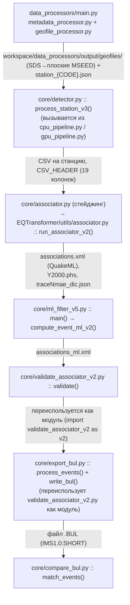
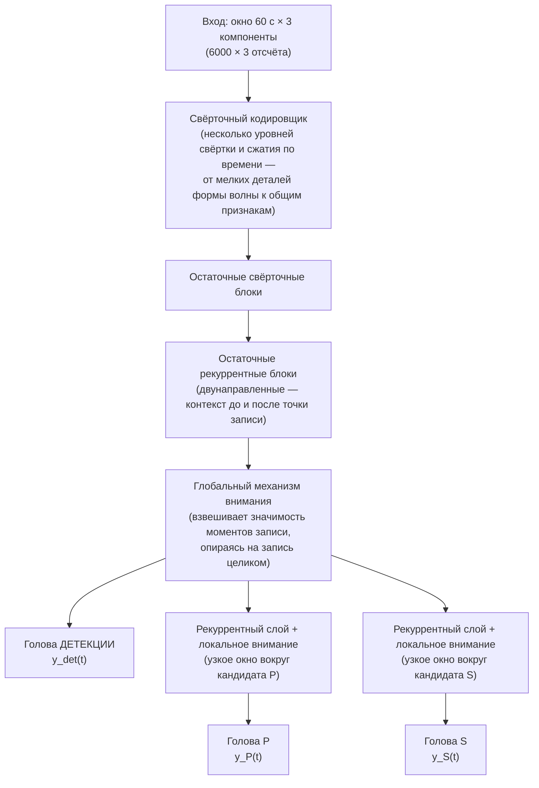
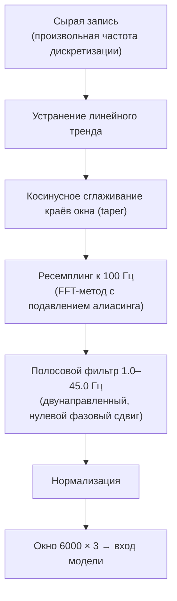
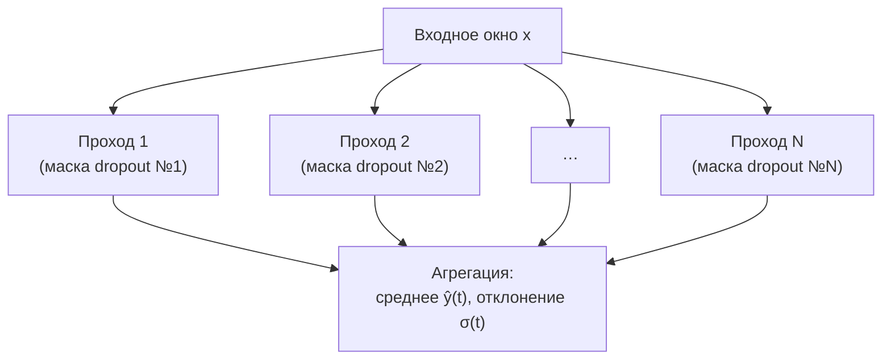
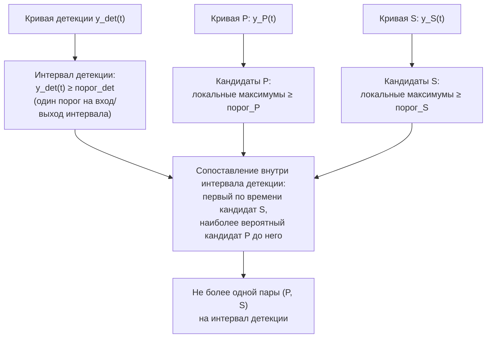
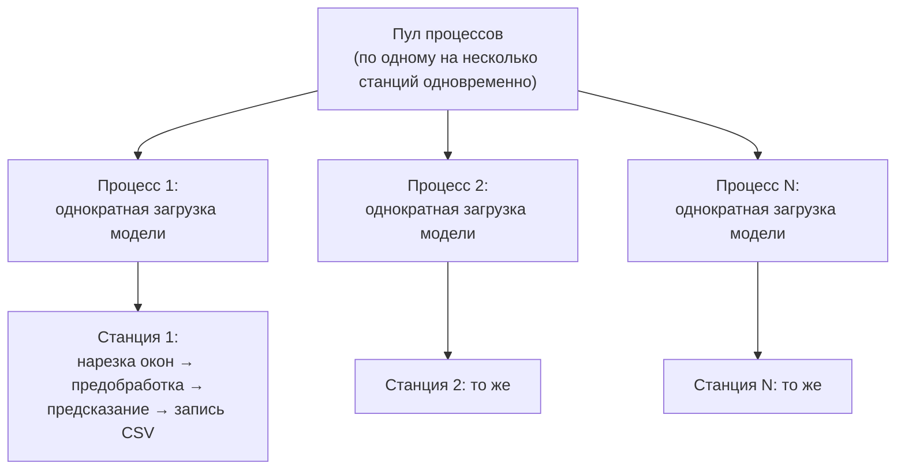
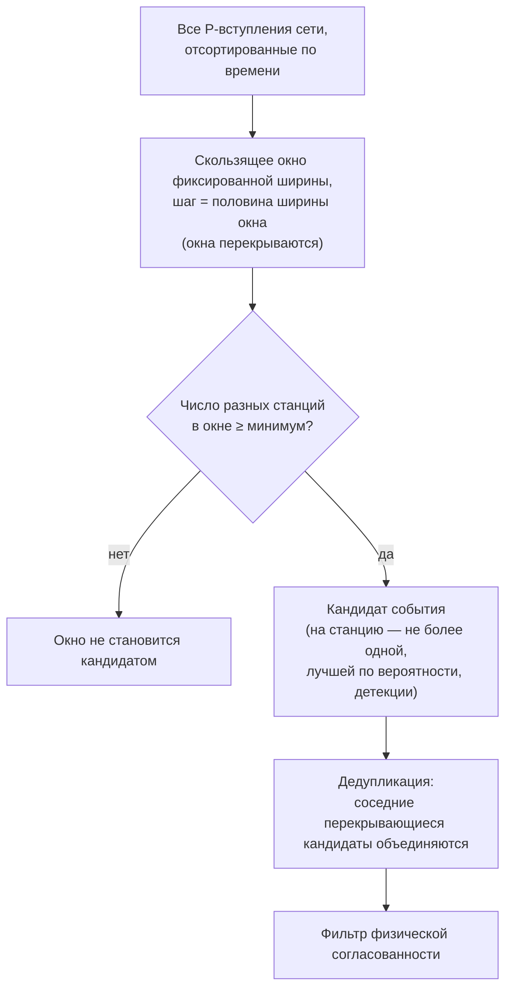
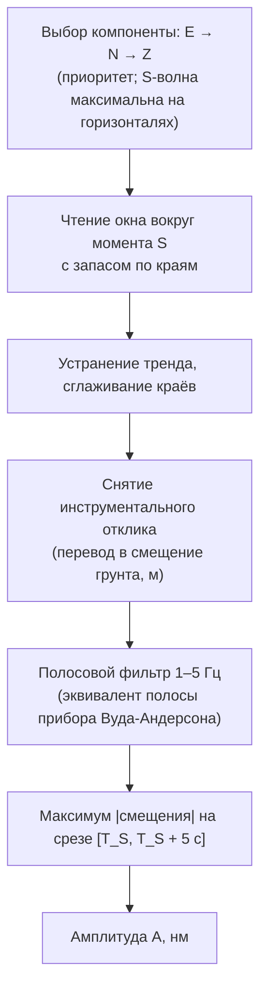
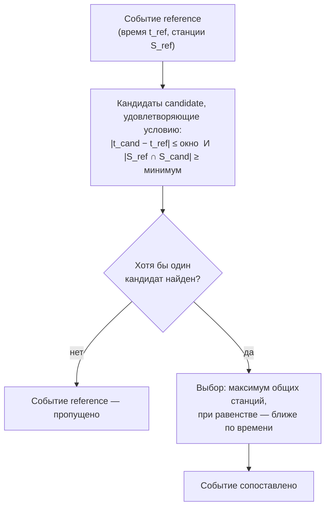

# Метод и пайплайн автоматического обнаружения сейсмических событий (форк EQTransformer) — полное описание

## 0. Назначение документа

Документ описывает конвейер автоматической обработки данных региональной сейсмической сети целиком — от исходных непрерывных записей до бюллетеня событий, сравнимого по форме с официальными бюллетенями ФИЦ ЕГС РАН — на одном уровне детализации: что физически измеряется/оценивается на каждом шаге и каким методом (формулы, пороги, физический смысл), и одновременно — как это реализовано в коде (модули, функции, форматы файлов, конфигурация, полный список CLI-параметров, известные особенности реализации). Документ самодостаточен: разделы идут в порядке фактического прохождения данных по конвейеру, от подготовки входных файлов (разд. 2) до сравнения готового бюллетеня с официальным (разд. 9), и каждый раздел объединяет физическое обоснование метода и его реализацию в коде.

**Сознательно исключённое.** Проверка метода на официальных бюллетенях НИИ на момент подготовки документа не завершена — здесь нет сводных показателей качества метода (recall, точность по времени/магнитуде). Приведены только параметры калибровки, пороги и константы конфигурации.

---

## 1. Общая схема конвейера

Обработка данных проходит семь последовательных этапов, реализованных отдельными модулями:



Таблица форматов на стыках модулей:

| Стык | Формат | Содержимое / ключевые поля |
|---|---|---|
| SDS-архив → `data_processors/geofile_processor.py` | miniSEED, суточные файлы `NET.STA.LOC.CHAN.TYPE.YEAR.DAY` | сырые отсчёты грунтового движения по трём компонентам |
| `geofile_processor.py` → `core/detector.py` | miniSEED, переименован в `NET.STA.LOC.CHAN.TYPE__start__end` | те же данные, явные ISO-таймстемпы начала/конца суток в имени файла |
| `metadata_processor.py` → все модули с геолокацией | JSON `{STA: {network, channels, coords:[lat,lon,elv]}}`, отдельный файл на станцию (`station_{CODE}.json`) | координаты станций и список каналов — используются детектором (запись в CSV), ассоциатором (проверка физической согласованности по расстоянию), экспортом бюллетеня (регион события, отсев дальних станций) |
| `core/detector.py::process_station_v3` → `core/associator.py` | CSV на станцию, `CSV_HEADER` (19 колонок) | время детекции, времена P/S (если найдены), вероятности, SNR, опционально — неопределённость MC Dropout |
| `associator.py` (стейджинг) → `run_associator_v2` | CSV `X_prediction_results.csv`, те же 19 колонок | отфильтрованное подмножество строк (в режиме `weight` — с переписанными вероятностями) |
| `run_associator_v2` → `ml_filter_v5.py` / `validate_associator_v2.py` | QuakeML `associations.xml` + `Y2000.phs` (hypoInverse) + `traceNmae_dic.json` | события с привязанными к ним P/S-пиками по станциям, без гипоцентра; `Event`/`Origin(только время)`/`Pick(phase_hint=P\|S)`, `publicID` вида `smi:local/...` |
| `ml_filter_v5.py` → `validate_associator_v2.py` / `export_bul.py` | QuakeML, тот же формат, отфильтрованный по ML | подмножество событий с ML выше заданного порога |
| `validate_associator_v2.py` / `export_bul.py` → `compare_bul.py` | текстовый бюллетень IMS1.0:SHORT (`.BUL`), фиксированные колонки | время очага, магнитуда (если посчитана), список фаз P/S по станциям; `Date[1:10]`, `Time[12:22]`, `Sta[0:5]` |

---

## 2. Подготовка входных данных (`data_processors/`)

### Оркестрация: `main.py`

`data_processors/main.py` запускается из своей же директории (`python data_processors/main.py`, пути внутри заданы относительно неё) и координирует два независимых шага — метаданные станций и сейсмические файлы. Каждый шаг выполняется только если **все** связанные с ним пути уже существуют — сам `main.py` ничего не создаёт; если условие не выполнено, скрипт печатает, какого пути не хватает, и переходит к следующему шагу без остановки.

**Шаг 1 (метаданные)** запускается при условии, что существуют и XML-папка метаданных, и выходной JSON-файл станций — причём это проверка существования именно **файла**, а не директории: `combine_inventories_to_json()` открывает его в режиме `'w'`, поэтому для первого запуска на новом месте файл нужно создать заранее вручную пустым, иначе шаг молча пропускается.

**Шаг 2 (сейсмические файлы)** запускается, если существуют обе директории — входная и выходная. Список станций не задаётся вручную: код сам находит все подпапки первого уровня во входной SDS-директории (это и есть коды станций) и передаёт их в `geofile_processor()`.

### Формат хранения исходных записей

Непрерывные записи хранятся в формате **SDS** (SeisComP Data Structure) — стандартной раскладке каталогов, которую использует SeisComP, ObsPy и большинство сейсмологических сетей:

```
<SDS>/ГОД/СЕТЬ/СТАНЦИЯ/КАНАЛ.ТИП/СЕТЬ.СТАНЦИЯ.ЛОКАЦИЯ.КАНАЛ.ТИП.ГОД.ДЕНЬ_ГОДА
```

Один файл — одна станция, один канал, одни сутки. Модуль `geofile_processor.py` рекурсивно обходит архив (`os.walk` — подхватывает файлы из любых вложенных подпапок), конвертирует номер дня года в явные ISO-таймстемпы начала и конца суток и переименовывает файлы в плоскую структуру (один каталог на станцию, без вложенности по годам/каналам):

$$
\texttt{СЕТЬ.СТАНЦИЯ.ЛОКАЦИЯ.КАНАЛ.ТИП.ГОД.ДЕНЬ\_ГОДА} \;\longrightarrow\; \texttt{СЕТЬ.СТАНЦИЯ.ЛОКАЦИЯ.КАНАЛ.ТИП\_\_20240401T000000Z\_\_20240402T000000Z}
$$

Это техническое преобразование, а не изменение данных: значения отсчётов не меняются, меняется только адресация файлов — под явный временной диапазон, который дальше по конвейеру использует детектор. Номер дня в году берётся как последняя точечная часть имени файла и проверяется на диапазон 1–365; год для пересчёта даты берётся из константы `date_from` в начале файла, а не из самого имени файла; итоговая копия файла делается под новым именем в плоский каталог назначения — вложенная структура исходного архива при этом не сохраняется (промежуточная переменная с именем вложенной подпапки, которую код вычисляет при обходе, нигде не используется).

На этом же шаге действует фильтр по датам (константы `date_from`/`date_to` в начале файла, не параметр функции): в обработку попадают только файлы, чьи сутки удовлетворяют условию

$$
\text{дата\_начала} \le t < \text{дата\_конца}
$$

(правая граница не включена). Файлы за пределами диапазона, а также файлы с некорректным номером дня в имени, в дальнейшую обработку не копируются.

### Метаданные станций

Метаданные сети (координаты станций, список рабочих каналов, отклик прибора) хранятся в формате **StationXML** (стандарт FDSN). Модуль `metadata_processor.py` сводит все XML-файлы сети в единый JSON вида `{код_станции: {сеть, каналы, координаты}}`. Этот JSON используется на всех дальнейших этапах, где нужна геолокация станции. Отдельно, инструментальный отклик станции (из тех же StationXML-файлов) используется позже, на этапе оценки магнитуды (разд. 7) — для перевода записи в физическое смещение грунта.

Реализация имеет три особенности, важные для эксплуатации: код станции берётся как код **первой** станции сети в конкретном XML-файле (даже если в файле их несколько); координаты берутся от **последней** станции внутреннего цикла обработки — не обязательно от той, чей код стал ключом; список каналов фильтруется по дате начала последнего **по порядку в файле** канала, а не по максимальной дате среди всех каналов, — при непредсказуемом порядке каналов результат зависит от их фактического порядка в XML. Из-за этого модуль рассчитан на XML с ровно одной станцией на сеть (типичный экспорт FDSN station-service по одной станции); на многостанционных XML координаты и каналы разных станций могут перемешаться под одним ключом. При объединении нескольких XML в общий JSON для уже встреченной станции список каналов дополняется без дедупликации (возможны повторы), а координаты не обновляются — остаются от первого встреченного файла.

---

## 3. Нейросетевая модель EQTransformer

### Архитектура

Модель принимает на вход окно записи фиксированной длины 60 секунд (6000 отсчётов при 100 Гц) по трём компонентам:



Три «головы» решают три разные, хотя и связанные задачи, каждая — со своей вероятностной кривой на выходе той же длины, что и входное окно (по одному значению $[0,1]$ на каждый из 6000 отсчётов): «есть ли в этом окне землетрясение» (детекция, взгляд на всю запись — глобальное внимание), «где именно начинается P» и «где именно начинается S» (два независимых узких взгляда — локальное внимание, каждый только вокруг своего кандидата). В коде (`EQTransformer/core/EqT_utils.py::cred2`) это: `_encoder` (7 слоёв свёртки и сжатия по времени) → 5 CNN-резидуальных блоков → 3 BiLSTM-резидуальных блока → глобальное внимание (два последовательных `_transformer`-блока, `attention_width=None` — по всей длине) → от общего закодированного представления отходят: декодер для детекции, и два независимых ответвления (LSTM + локальное внимание, `attention_width=3` — буквально узкое окно ±3 отсчёта) для P и S.

Веса модели (`EqT_original_model.h5`) обучены один раз на выборке STEAD (~1 млн размеченных записей, ~450 тыс. событий, глобальное распределение, эпицентральные расстояния до 300 км, официальный набор весов пакета — «original», не «conservative») и в этом виде используются без дообучения под данные конкретной сети — с честной оговоркой о пределах применимости такого переноса. Файлы, отвечающие за это в проекте: `EQTransformer/core/EqT_utils.py` (сама архитектура, не модифицируется форком), `EQTransformer/core/predictor.py` (обёртка над загруженной моделью, реализующая батчевый вызов и MC Dropout — `predictor_mem_non_hdf_load_model_v6`), `EQTransformer/utils/hdf5_maker.py` (предобработка — `preprocessorV7_mem`).

### Предобработка окна перед подачей в модель

Перед вычислением вероятностных кривых запись проходит фиксированную последовательность операций:



**Порядок ресемплинг → фильтрация выбран не случайно.** Полосовой фильтр с верхней границей 45 Гц физически корректен только тогда, когда частота Найквиста записи (половина частоты дискретизации) выше 45 Гц — то есть частота дискретизации должна быть не ниже ~90–100 Гц. Приведение частоты к 100 Гц выполняется до фильтрации именно поэтому: так верхняя граница полосы остаётся физически корректной независимо от исходной частоты дискретизации записи конкретной станции, включая станции сети, пишущие на пониженной частоте.

Нормализация — деление окна на его собственное стандартное отклонение по каждому компоненту записи независимо:

$$
X_{\text{норм}} = \frac{X}{\operatorname{std}(X)}
$$

Смысл шага — привести входы разного физического масштаба (разные станции, разные усиления канала, разные по силе события) к одному диапазону значений, в котором обучалась модель.

### Оценка неопределённости (Monte Carlo Dropout)

Внутри модели используются слои с исключением связей (dropout), которые при обычном предсказании отключены — сеть даёт один и тот же детерминированный ответ на один и тот же вход (это стандартное поведение Keras/TensorFlow на инференсе, не особенность нашего кода). Оценка неопределённости получается иначе: dropout **намеренно оставляется активным**, и на одном и том же входном окне $x$ модель $N$ раз независимо запрашивается заново, каждый раз со своей случайной маской отключённых связей:



$$
\hat{y}(t) = \frac{1}{N}\sum_{i=1}^{N} y_i(t)
\qquad\qquad
\sigma(t) = \sqrt{\frac{1}{N}\sum_{i=1}^{N} \big(y_i(t) - \hat{y}(t)\big)^2}
$$

Среднее $\hat{y}(t)$ берётся как итоговая вероятность (детекции, P или S — отдельно для каждой из трёх кривых), а стандартное отклонение $\sigma(t)$ — как оценка неопределённости этой вероятности в данной точке записи: малый разброс между проходами означает, что решение модели устойчиво к случайному отключению части её внутренних связей (высокая уверенность), большой разброс — низкая уверенность. Эта величина используется дальше, на этапе ассоциации (разд. 5).

В реализации (`predictor_mem_non_hdf_load_model_v6`) это устроено через внутреннюю функцию `_mc_forward`, которая вызывает модель с явным `training=True` — единственный способ физически удержать dropout активным на инференсе; `number_of_sampling` независимых проходов батчатся в один вызов, а не выполняются последовательно (оптимизация скорости, результат тот же). В текущих рабочих прогонах оценка неопределённости считается всегда, не по отдельному запросу.

### Извлечение моментов P/S из вероятностных кривых

Три вероятностные кривые (детекция, P, S) по отдельному 60-секундному окну ещё не дают готового «списка событий» — их нужно свести к дискретным моментам:



В реализации (`EqT_utils.py::picker`) интервал детекции извлекается через `trigger_onset` (стандартный STA/LTA-стиль триггер с одинаковым порогом включения/выключения), а кандидаты P/S — через поиск локальных максимумов вероятностной кривой с минимальным расстоянием между пиками в 1 отсчёт (отбираются практически все локальные максимумы выше порога, не один глобальный). В сопоставлении участвуют только интервалы детекции длительностью не менее 0.1 с (10 отсчётов) — более короткие всплески вероятности не рассматриваются как полноценный интервал события.

**Ключевое уточнение о физическом смысле найденного момента.** Момент, извлечённый на этом шаге, — это положение локального максимума **вероятностной кривой**, а не положение максимума амплитуды колебания на исходной записи. Метки обучающей выборки строятся вокруг **момента вступления фазы** — первого заметного отклонения записи от фонового шума при приходе P или S волны, а не вокруг момента наибольшей амплитуды колебания внутри самой фазы. Соответственно найденный моделью пик физически ближе к «моменту начала вступления», чем к «максимальному значению колебания». Это принципиально иной момент, чем тот, что используется позже, отдельно, для оценки магнитуды (разд. 7) — там намеренно измеряется именно максимум амплитуды в фиксированном окне после S-вступления, а не момент вступления. Оба момента лежат на одной и той же записи, но не совпадают друг с другом и решают разные задачи.

---

## 4. Модуль детекции: `core/detector.py`, `core/cpu_pipeline.py`, `core/gpu_pipeline.py`

### Нарезка суточной записи на окна

`detector.py` читает суточные файлы одной станции по всем доступным каналам и нарезает объединённый поток на перекрывающиеся окна длиной 10 минут с шагом 5 минут (перекрытие 50%):


Перекрытие нужно для того, чтобы вступление, попавшее близко к границе одного окна, гарантированно целиком оказалось внутри соседнего окна и не было потеряно или разрезано пополам. Отдельно, после последнего полного шага, добавляется хвостовое окно (последние 10 минут суток) — иначе конец суточной записи мог бы не попасть ни в одно окно из-за целочисленного шага. В реализации (`geofile_splitter_multi_chanels_v3`, генератор — не список, обрабатывает файлы одной станции по очереди, не держит в памяти весь месяц) файлы находятся регэкспом по имени, группируются по ключу «станция+начало суток» (все каналы одного суточного файла — в одну группу), группа с менее чем двумя каналами после чтения пропускается; суточный поток явно удаляется из памяти после каждой группы (пиковое потребление памяти — один суточный поток + один сегмент в обработке).

Окно передаётся на детекцию, только если в нём физически присутствуют отсчёты не менее чем по двум из трёх компонент станции — распознавание вступления по единственной компоненте не выполняется.

Каждое такое 10-минутное окно, в свою очередь, разбивается уже внутри самого предиктора на короткие 60-секундные под-окна — под фиксированный размер входа модели (разд. 3) — и все под-окна одного 10-минутного окна объединяются в один пакетный вызов модели, а не обрабатываются по одному. Это чисто вычислительная оптимизация: батчинг по 10-минутным сегментам вместо вызова модели на каждое 60-секундное под-окно отдельно сокращает число обращений к модели на порядок, что для полного месяца данных на одну станцию превращает счёт из часов в десятки минут.

### Пороги на выходе модели

Для каждого пройденного через модель окна извлечённые кандидаты P/S проходят через пороги вероятности:

| Порог | Действующее значение | Смысл |
|---|---|---|
| порог детекции | $0.75$ | ниже этого значения вероятностная кривая детекции не формирует интервал события |
| порог P | $0.30$ | минимальная вероятность, чтобы локальный максимум $y_P(t)$ считался кандидатом P |
| порог S | $0.20$ | минимальная вероятность, чтобы локальный максимум $y_S(t)$ считался кандидатом S |

Эти значения — не встроенные константы официального пакета EQTransformer, а результат ручной калибровки под региональную сеть. Официальный репозиторий модели явно рекомендует разные пороги для двух наборов весов: ≈0.5/0.3/0.3 для «original» (используемых здесь), ≈0.03 для всех — для «conservative»; дефолты в самих сигнатурах оригинального `predictor()` ещё ниже (0.3/0.1/0.1). Наш порог детекции (0.75) выше даже официальной рекомендации для «original» — осознанный выбор в пользу меньшего числа ложных срабатываний на данных конкретной сети, за счёт более консервативного отбора. Значения — настраиваемые параметры конвейера (зашиты внутри тела `worker_v4` в `detector.py`, не аргументы функции, не настраиваются из `cpu_pipeline.py`/`gpu_pipeline.py` без правки самого файла) и могут быть изменены под конкретную задачу.

Отдельно используется ограничение максимального допустимого интервала между кандидатами P и S внутри одного интервала детекции: $\Delta T_{max} = 45$ с. Через ту же формулу пересчёта разности времён P/S в расстояние (разд. 6, коэффициент $k = \dfrac{V_p V_s}{V_p - V_s} \approx 8.33$ км/с) это соответствует физическому ограничению

$$
R_{max} = k \cdot \Delta T_{max} \approx 8.33 \times 45 \approx 375\text{–}380 \text{ км}
$$

Пара P/S, разнесённая по времени сильнее этого предела, физически не может относиться к близко расположенному локальному землетрясению и не рассматривается моделью как валидная пара уже на этом, самом раннем этапе — до всякой сетевой ассоциации.

### Отношение сигнал/шум

Для каждой найденной пары P/S дополнительно вычисляется отношение сигнал/шум (SNR) на записи вокруг найденного момента — количественная мера того, насколько чётко колебание выделяется на фоне окружающего шума. Эта величина используется дальше как один из критериев отбора на этапе стейджинга (разд. 5) и как один из весов при агрегации оценок времени очага по нескольким станциям (разд. 6).

### Результат: CSV на станцию

Для каждой станции пишется один CSV-файл, куда построчно (по мере обработки, не только в конце) добавляется одна строка на каждое найденное вступление. Полный `CSV_HEADER` (19 колонок):

```
file_name, network, station, instrument_type,
station_lat, station_lon, station_elv,
event_start_time, event_end_time,
detection_probability, detection_uncertainty,
p_arrival_time, p_probability, p_uncertainty, p_snr,
s_arrival_time, s_probability, s_uncertainty, s_snr
```

Драйвер по сегментам (`preproc_sequential_v5`) открывает файл в режиме `'w'`, сразу пишет заголовок, затем на каждый обработанный сегмент (`worker_v4`) сразу пишет вернувшиеся строки и делает `flush()` — детекции появляются в файле по ходу обработки, не только в самом конце (если процесс упадёт на середине месяца, часть результатов уже на диске). Каждые 50 обработанных сегментов — сборка мусора (`gc.collect()`).

### Точка входа по станции и параллельный запуск

Точка входа по одной станции — `process_station_v3()`; её вызывают обёртки `cpu_pipeline.py`/`gpu_pipeline.py`, передавая диапазон дат явно и пробрасывая параметры MC Dropout до предиктора. `detector.py` также поддерживает прямой запуск (`python core/detector.py --stations ...`) через тот же `process_station_v3()` — однопроцессный, без пула воркеров: список станций обрабатывается последовательно, одной уже загруженной моделью. Параллельная обработка нескольких станций одновременно нужна через один из pipeline-файлов.

Загрузка модели — самая дорогая по времени операция, поэтому она выполняется один раз на процесс, а не один раз на станцию:



Реализовано через `ProcessPoolExecutor` с функцией-инициализатором (`_init_worker`): она выполняется один раз при старте каждого процесса-воркера, до получения им первой станции — добавляет корень репозитория в `sys.path` (процесс-воркер запускается как отдельный интерпретатор Python и не наследует изменения `sys.path`, сделанные родительским процессом после старта), настраивает вычислительное устройство и один раз загружает модель (`load_model_cudnn_v2`) в глобальную переменную процесса — эта же модель переиспользуется для всех станций, которые попадут именно в этот процесс (модель нельзя передать между процессами напрямую, только загрузить заново в каждом). Сам `detector.py` при этом загружается не обычным `import`, а через `importlib.util.spec_from_file_location` — так каждый процесс получает собственный экземпляр модуля независимо от того, как именно организован путь запуска. Функция-задача (`run_station`) вызывает `process_station_v3(..., model=_model, ...)` для каждой станции по очереди из очереди пула; любое исключение перехватывается целиком и возвращается как `(station_name, "error", traceback)` — ошибка на одной станции не останавливает обработку остальных.

`cpu_pipeline.py` и `gpu_pipeline.py` различаются только используемым вычислительным устройством:

| | `cpu_pipeline.py` | `gpu_pipeline.py` |
|---|---|---|
| Устройство | `tf.config.set_visible_devices([], 'GPU')` — GPU принудительно скрыт от процесса | GPU используется, `set_memory_growth` — видеопамять выделяется по мере надобности, не сразу вся |
| TF-параллелизм | `set_inter/intra_op_parallelism_threads` на воркер — ограничение числа потоков TensorFlow на процесс, чтобы параллельные процессы не конкурировали за одни и те же ядра | не ограничивается |
| `MAX_WORKERS` | подбирается под число CPU-ядер (пример для машины на 12 ядер: 4 воркера × 3 потока — баланс скорости и параллелизма; 6×2 — больше параллельных станций; 8×1–2 — максимум параллельных станций, каждая медленнее) | подбирается под объём VRAM — несколько процессов держат в памяти каждый свою копию модели и активаций одновременно, явного лимита VRAM между воркерами в коде нет |
| Диапазон дат | целый календарный месяц (`TARGET_MONTH`/`TARGET_YEAR` → `calendar.monthrange`) | произвольный диапазон (`DATE_FROM`/`DATE_TO`, `UTCDateTime`) напрямую |

Собственной логики детекции ни один из двух файлов не содержит — оба загружают `detector.py` и вызывают тот же самый `process_station_v3()`. Число воркеров (`--max-workers`) подбирается под число CPU-ядер в `cpu_pipeline.py` и под объём VRAM в `gpu_pipeline.py`; разовый ручной калькулятор доли ядер (`core/threads.py`) существует отдельно, никуда не встроен.

Отдельная инженерная деталь, не относящаяся к детекции напрямую: модель использует LSTM-слои, для которых быстрый GPU-режим (cuDNN) требует определённых параметров слоя (`recurrent_dropout=0.0`, `implementation=2`), а эти параметры — доступные только для чтения свойства самого слоя после загрузки. Обход — присвоение тех же значений на внутреннем объекте ячейки LSTM (`lstm.cell`), куда запись разрешена; патч применяется сразу после загрузки модели и до первого вызова предсказания. При самой загрузке модели неизбежно печатается предупреждение о несовместимости с cuDNN — это косметика: предупреждение возникает до применения патча, реальный инференс уже идёт через быстрый режим.

---

## 5. Модуль ассоциации (`core/associator.py`)

Задача этого модуля — объединить независимые по станциям детекции в кандидатов сетевых событий и отсеять то, что физически не может быть одним и тем же землетрясением. Состоит из двух последовательных шагов: подготовка (стейджинг) и собственно ассоциация.

### Шаг 1 — стейджинг: фильтрация и (опционально) взвешивание детекций

Перед сборкой событий каждая строка CSV детектора проверяется на соответствие порогам. Пик P засчитывается, если

$$
T_P \neq \varnothing \;\wedge\; p_P \ge P_{THR} \;\wedge\; \big(SNR_P \ge SNR_{THR}\text{, если порог задан}\big),
$$

и аналогично для пика S (с $p_S \ge S_{THR}$). Строка (детекция) в целом проходит стейджинг, если

$$
p_{det} \ge DET_{THR} \;\wedge\; \big(\text{есть и P, и S} \;\vee\; \text{есть хотя бы одна из фаз}\big),
$$

где выбор между «и P, и S» и «хотя бы одна из фаз» — настраиваемый режим (константа `KEEP_PS`).

Учёт неопределённости, полученной MC Dropout (разд. 3), возможен в трёх режимах (`UNCERTAINTY_MODE`), различающихся тем, к какой вероятности применяется порог и что записывается дальше:

| Режим | Что подставляется в проверку порога | Что записывается дальше |
|---|---|---|
| `'none'` (без учёта) | сырая вероятность $p$ | вероятности как есть |
| `'filter'` (фильтрующий) | эффективная вероятность $p_{\text{эфф}} = p\cdot(1-u)$ | вероятности как есть |
| `'weight'` (взвешивающий) | сырая вероятность (порог не меняется) | вероятности **переписываются** на $p_{\text{эфф}} = p\cdot(1-u)$ — неопределённость не влияет на то, что проходит стейджинг, но снижает вес пика во всех дальнейших вычислениях |

где $u$ — оценка неопределённости этой же вероятности. Смысл — пик, в котором модель сама неуверена (большой разброс между проходами MC Dropout), либо не проходит порог вовсе (`filter`), либо проходит, но с меньшим весом при дальнейшей агрегации (`weight`). В коде эти два фильтра — отдельные функции (`_passes` по сырой вероятности, `_passes_v2` по эффективной), а взвешивание выполняет `_apply_weight`. Перед стейджингом скрипт сам удаляет из рабочей директории подпапки станций, которых больше нет в текущем списке `STATIONS`, — иначе ассоциатор дальше по цепочке подхватил бы данные станций, исключённых из прогона (он читает все подпапки директории, а не только перечисленные явно).

### Шаг 2 — сборка кандидатов события: скользящее окно по времени P



Окна перекрываются — событие не может «провалиться» между двумя соседними неперекрывающимися интервалами; поскольку соседние положения окна перекрываются, одно и то же землетрясение почти всегда порождает несколько кандидатов подряд. Два кандидата считаются одним и тем же событием и объединяются, если

$$
|t_1 - t_2| \le \text{шаг} \quad\wedge\quad |S_1 \cap S_2| \ge \max(2,\; n_{min}-1),
$$

где $S_1$, $S_2$ — множества станций двух кандидатов, $n_{min}$ — минимальное число станций для события. Реализовано эффективно (`np.searchsorted`, $O(\log N)$ на положение окна, а не полный проход по таблице); внутри окна на станцию остаётся только детекция с максимальной вероятностью.

### Шаг 3 — фильтр физической согласованности

Для каждого кандидата события проверяется, что времена прихода P на всех парах входящих в него станций физически совместимы друг с другом:

$$
\big|T_P(A) - T_P(B)\big| \;\le\; \frac{d(A,B)}{V_p} + \tau
$$

где $d(A,B)$ — географическое расстояние между станциями, $V_p$ — скорость P-волны (зафиксирована внутри этой функции, `6.0` км/с — та же величина, что используется на этапе оценки расстояния, разд. 6), $\tau$ — небольшой допуск, покрывающий собственную погрешность модели в определении момента P и погрешность скоростной модели. Смысл неравенства — прямое следствие принципа: если разница времён прихода P на двух станциях больше времени, которое реально нужно P-волне, чтобы пройти расстояние между этими станциями (плюс разумный запас на погрешность), то эти две станции физически не могли зафиксировать один и тот же близко расположенный источник.

Если для кандидата находятся станции, нарушающие это условие с кем-то ещё в наборе, — из набора итеративно удаляется станция с наибольшим числом нарушений (при равенстве — с меньшей вероятностью детекции), пока оставшийся набор не станет полностью согласованным или пока станций не станет меньше требуемого минимума (тогда кандидат отбрасывается целиком). Реализация делает полный перебор всех пар станций на каждой итерации удаления — для типичных размеров события (несколько–десяток станций) не критично, но не рассчитана на сотни станций в одном окне. Отдельно, более старая версия ассоциатора (группировка по времени начала окна детекции, а не по времени P-пика — страдающая от «проблемы границы корзины», когда одно и то же событие на разных станциях может дать разные бины и никогда не набрать минимум совпадений) поддерживала дополнительный режим полного перебора комбинаций станций внутри окна; используемая сейчас версия алгоритма этот режим не поддерживает — конвейер всегда работает без него.

**Практическое значение допуска $\tau$.** Слишком мягкий допуск пропускает в один кандидат станции, которые в действительности зафиксировали два разных, близких по времени события (объединяя их в один «размытый» результат с ухудшенным качеством последующей оценки времени очага и магнитуды); слишком жёсткий допуск начинает разбивать одно реальное событие на несколько кандидатов из-за обычного разброса ошибок пикинга. Диагностика на реальных данных сети подтверждает, что действующее значение допуска обеспечивает чистое разделение близких по времени, но физически разных событий, не теряя при этом в общем числе найденных ассоциаций — точность проявляется именно в чистоте состава станций внутри каждого кандидата.

### Результат

Каждый прошедший оба фильтра кандидат становится событием: время очага на этом этапе — минимум времени P среди подтвердивших станций (грубая оценка, точная оценка делается позже, разд. 6). Результат пишется в трёх видах:

- **`associations.xml`** — QuakeML-каталог: `Event`/`Origin(время события, координаты — первая станция кандидата как техническая заглушка, не настоящая локация)`/`Pick(время, код станции, `phase_hint`=`P`/`S`)` на событие.
- **`Y2000.phs`** — тот же результат в формате фаз hypoInverse (одна гипоцентровая строка с теми же координатами-заглушкой, зафиксированными `depth=5.0`/`mag=0.0`, плюс строки фаз) — формат, который принимают внешние локаторы.
- **`traceNmae_dic.json`** — словарь `{event_id: [имена_трасс]}` — нужен, если потом требуется вытащить исходные записи для кросс-корреляции при релокации.

Собственная библиотека временно строит SQLite-базу (`phase_dataset`) для промежуточной агрегации пиков — единственный путь в этой связке, создаваемый по **относительному** имени файла (от текущей рабочей директории запуска, а не от корня репозитория), поэтому запускать `associator.py` нужно из одного и того же места; при параллельном запуске двух ассоциаций из одной директории один прогон удалит базу другого. Отдельно: если внутри окна на одну станцию неожиданно попало больше одной строки после дедупликации, они могут быть записаны как второе, отдельное событие в `Y2000.phs`/`traceNmae_dic.json`, но не как отдельный `Event` в `associations.xml` — при сверке числа событий по разным выходным файлам это стоит иметь в виду.

---

## 6. Оценка времени очага и расстояния без локации (метод S-P)

### Почему нет полноценной локации

Определение координат и глубины очага (локация) требует согласованных направлений на событие с нескольких станций и построения решения методом инверсии по сети. Этот шаг в методе не реализован ни на одном этапе конвейера — ограничение, действующее во всех модулях, начиная с ассоциатора и заканчивая экспортом бюллетеня. Вместо координат метод оценивает только время очага и приблизительное расстояние до каждой отдельной станции.

### Формула расстояния и времени очага по разности P и S

Для станции, где обнаружены и P, и S вступления, разность времён прихода

$$
\Delta T = T_S - T_P
$$

даёт оценку расстояния станция–очаг

$$
R = \frac{V_p V_s}{V_p - V_s}\,\Delta T,
$$

откуда время очага восстанавливается двумя эквивалентными способами:

$$
T_0 = T_P - \frac{R}{V_p} = T_S - \frac{R}{V_s}.
$$

Оба выражения совпадают по построению (это тождество, а не независимая проверка, так как $R$ выведено из той же самой пары $(T_P, T_S)$). Используемые скорости — коровая модель: $V_p = 6.0$ км/с, $V_s = 3.4883$ км/с, что даёт коэффициент $k = \dfrac{V_p V_s}{V_p - V_s} \approx 8.33$ км/с. Эта же скоростная модель — не из статьи-источника формулы магнитуды (разд. 7), а получена отдельно от научного консультанта (Р.А. Дягилев, ФИЦ ЕГС РАН), не задокументирована в открытой публикации.

### Отбор станций по расстоянию

Станции с оценённым расстоянием $R$ ниже нижнего предела (по умолчанию $20$ км, флаг `--r-min`) исключаются из оценки времени очага события целиком: на таких расстояниях P и S ещё недостаточно разделены во времени, и сама линейная зависимость $R(\Delta T)$ вблизи источника ненадёжна. При необходимости может быть дополнительно задан и верхний предел `--r-max`, ограничивающий состав станций дальней границей.

### Отбраковка станций-выбросов

Внутри одного события индивидуальные оценки $T_0$ по разным станциям расходятся — из-за ошибок пикинга P/S, локальных искажений скорости, шума. Применяется статистический фильтр:

$$
\operatorname{med} = \operatorname{median}(T_{0,i}) \qquad
\sigma = \operatorname{std}(T_{0,i} - \operatorname{med})
$$

$$
\text{станция — «нормальная»,} \quad \big|T_{0,i} - \operatorname{med}\big| \le k\sigma
$$

Станции, для которых это неравенство нарушено, считаются выбросами и исключаются из дальнейшего расчёта. Если после отбраковки остаётся меньше минимально допустимого числа станций (`MIN_STATIONS=3`), фильтр отменяется целиком и используются все исходные станции без исключений — с явной пометкой события как «менее надёжного».

⚠️ **CLI-параметр по умолчанию (`--sigma 1.0`) не совпадает с тем, что реально используется (`2.0`).** Более строгий порог режет слишком много станций при малых сетях, где сама σ по нескольким точкам ещё нестабильна — при `--sigma 1.0` отбрасывается слишком много валидных станций как «выбросы».

### Объединение оценок нескольких станций в одно время очага

Оценка $T_0$ по единственной станции — самая ненадёжная: одна ошибка пикинга целиком искажает результат. Отфильтрованные оценки объединяются несколькими способами, отличающимися весами ($N$ — все станции, $M$ — станции, прошедшие $\sigma$-фильтр, $p_i$ — вероятность пика P на станции $i$, $\mathrm{SNR}_i$ — отношение сигнал/шум на этой же станции):

$$
T_0^{\min} = T_{0,\,j}, \quad j = \arg\min_i \Delta T_i \qquad\text{(ближайшая станция)}
$$

$$
T_0^{\text{raw}} = \frac{1}{N}\sum_{i=1}^{N} T_{0,i} \qquad\text{(среднее по всем, без фильтра)}
$$

$$
T_0^{\text{mean}} = \frac{1}{M}\sum_{i=1}^{M} T_{0,i} \qquad\text{(среднее по станциям, прошедшим $\sigma$-фильтр)}
$$

$$
T_0^{\text{wmean}} = \frac{\displaystyle\sum_i T_{0,i}\big/\Delta T_i^{\,2}}{\displaystyle\sum_i 1\big/\Delta T_i^{\,2}} \qquad\text{(вес $\sim$ обратный квадрат $\Delta T$)}
$$

$$
T_0^{\text{probw}} = \frac{\displaystyle\sum_i T_{0,i}\, p_i}{\displaystyle\sum_i p_i} \qquad\text{(вес — вероятность пика P)}
$$

$$
T_0^{\text{probsnr}} = \frac{\displaystyle\sum_i T_{0,i}\, p_i\, \mathrm{SNR}_i}{\displaystyle\sum_i p_i\, \mathrm{SNR}_i} \qquad\text{(вес — вероятность $\times$ SNR)}
$$

Взвешивание по произведению вероятности пика и отношения сигнал/шум ($T_0^{\text{probsnr}}$) физически обосновано следующим образом: момент вступления, извлечённый моделью (разд. 3), не всегда в точности совпадает с истинным началом фазы — при слабом или зашумлённом сигнале вероятностная кривая модели нарастает постепенно, и точка, где она впервые уверенно превышает порог, может оказаться смещена относительно истинного момента вступления. Эта погрешность заметнее на записях с низким отношением сигнал/шум и низкой уверенностью модели — то есть именно там, где веса $p_i$ и $\mathrm{SNR}_i$ малы. Поскольку ошибка в определении $T_P$ входит в оценку расстояния $R$ (и тем самым в $T_0$) с коэффициентом

$$
\frac{V_p}{V_p - V_s} \approx 2.4,
$$

небольшое смещение момента P на записи с плохим качеством сигнала даёт заметно увеличенное смещение итоговой оценки времени очага для этой станции. Взвешивание по $p \cdot \mathrm{SNR}$ понижает вклад именно таких, потенциально смещённых станций, не отбрасывая их совсем.

Взвешивание по обратному квадрату расстояния ($T_0^{\text{wmean}}$) на практике оказывается менее эффективным, чем можно было бы ожидать: близость станции к очагу сама по себе не гарантирует более точный пик модели.

⚠️ **CLI-параметр по умолчанию (`--match-by min`, то есть $T_0^{\min}$) не совпадает с тем, что реально используется (`psnr`, то есть $T_0^{\text{probsnr}}$)** — по указанной выше причине: ближайшая станция может дать единственный плохой пик, и оценку скорректировать нечем, тогда как `psnr` компенсирует именно те станции, где смещение вероятнее всего велико. `ot_probw`/`ot_probsnr` требуют отдельного источника данных (папки со стейджинг-CSV, откуда берутся вероятность и SNR P-пика по ключу станция+время) — без него они недоступны, и выбор откатывается на `ot_mean`, затем на `ot`.

### Сравнение с эталонным каталогом

Помимо оценки $T_0$, этот же метод сопоставляет каждое событие эталонного каталога с ближайшей по времени ассоциацией сети: подходящей считается ассоциация, чья оценка $T_0$ отличается от каталожного времени не более чем на заданный допуск (по умолчанию $60$ с). Дополнительно может быть задано минимальное число подтверждающих станций — по общему числу станций, вошедших в ассоциацию, либо только по числу станций, прошедших $\sigma$-фильтр. Если у ближайшей по времени ассоциации станций недостаточно, каталожное событие считается ненайденным, даже если оно ближе всего по времени. Тот же принцип сопоставления (окно допуска по времени плюс требование по общим станциям) используется и на уровне готовых бюллетеней — см. разд. 9.

Модуль умеет писать отфильтрованный результат обратно в QuakeML (`write_quakeml`, формат BED 1.2): `Origin` содержит только время (`ot_probsnr` с откатом на `ot`/`ot_mean`) — координаты не пишутся никогда, `Magnitude` добавляется, если ML посчитан. Полный список параметров командной строки:

| Флаг | По умолчанию | Назначение |
|---|---|---|
| `--assoc` | путь к входному XML ассоциатора | входной файл |
| `--catalog` | `catalog.xlsx` | эталонный каталог |
| `--window` | `60` с | допуск сравнения T0 с каталогом |
| `--vp` / `--vs` | `6.0` / `3.4883` км/с | скорости модели |
| `--sigma` | `1.0` (на практике `2.0`) | множитель σ для отброса станций-выбросов при оценке T0 |
| `--year` / `--month` | нет | фильтр каталога по дате |
| `--min-mag` | нет | минимальная магнитуда каталога |
| `--r-min` / `--r-max` | `20.0` / нет | границы R (км) для включения станции в оценку T0 |
| `--amps` | путь к CSV амплитуд | источник данных для ML |
| `--no-amps` | выкл. | не считать ML вообще |
| `--sta-corrections` | нет | CSV станционных поправок `station,S` |
| `--prob-dir` | нет | папка со стейджинг-CSV для `ot_probw`/`ot_probsnr` |
| `--match-by` | `min` (на практике `psnr`) | какую оценку T0 использовать для матчинга (`min`/`mean`/`psnr`) |
| `--min-stations` | `1` | минимум станций для засчитывания совпадения |
| `--min-stations-mode` | `xml` | считать минимум по `N` (все станции XML) или `σN` (после σ-фильтра) |
| `--show-picks` / `--show-all-picks` / `--show-flagged` / `--show-all` | выкл. | режимы диагностического вывода — построчный разбор пиков по станциям для найденного события, то же для всех ассоциаций, только события с флагом «мало станций», сводная таблица всех ассоциаций |
| `--out-csv` | нет | путь для CSV/текстового вывода |
| `--out-xml` | нет | путь для записи отфильтрованных событий через `write_quakeml` |

Модуль `export_bul.py` (разд. 8) переиспользует этот же код напрямую как библиотеку, не дублируя формулы: импортирует модуль (`import validate_associator_v2 as v2`) и использует его функции напрямую — `estimate_origin_times_v2` (оценка T0), `sigma_filter` (отброс станций-выбросов), `compute_ml` (магнитуда по формуле разд. 7), `load_associations`/`load_amplitudes`/`load_pick_probabilities` (чтение входных файлов), а также дефолтные константы модуля (скорости, порог σ, минимум станций) — но с T0, зафиксированным на `probsnr` с откатом на `ot` (без выбора других вариантов через параметры, в отличие от полного набора, доступного в `validate_associator_v2.py` через `--match-by`).

---

## 7. Оценка локальной магнитуды (`core/ml_filter_v5.py`)

### Формула

Используется формула локальной магнитуды $ML$, откалиброванная для Терско-Каспийского прогиба (Дягилев, Габсатарова, Селиванова, 2023) по 64 землетрясениям 2020–2022 гг., записанным 58 станциями на расстояниях 25–526 км:

$$
ML_i = \lg A_i + a\lg R_i + bR_i + c + S_i
$$

где для станции $i$: $A_i$ — максимальная амплитуда S-волны (нм, измеряется отдельно, см. ниже), $R_i$ — расстояние станция–очаг, оценённое методом S-P (разд. 6, км), а коэффициенты

$$
a = 1.024, \qquad b = 0.001648 \text{ км}^{-1}, \qquad c = -1.889,
$$

получены калибровкой по региональным данным; $S_i$ — станционная поправка (по умолчанию $0$, см. ниже).

Физический смысл каждого члена:

| Член | Физический механизм |
|---|---|
| $\lg A_i$ | логарифмическая шкала силы толчка — рост на единицу магнитуды соответствует примерно десятикратному росту амплитуды записи |
| $a \lg R_i$ | геометрическое расхождение волнового фронта с расстоянием |
| $b R_i$ | неупругое поглощение энергии средой (экспоненциальное затухание, линейное в логарифмическом масштабе) |
| $c$ | свободный член калибровки, приводящий формулу к опорной точке шкалы |
| $S_i$ | локальная поправка на грунтовые условия под конкретной станцией |

Оба коэффициента поправки на расстояние ($a$, $b$) откалиброваны на реальных региональных землетрясениях, а не заимствованы из общей теории затухания. Формула — уравнение (5б) статьи-источника, «вариант 2» калибровки (по всем 749 измерениям без дополнительной фильтрации по частным a/b, в отличие от более строгого «варианта 1», формула 4б: `0.964`/`0.001847`/`−1.791` по 571 измерению) — разница между вариантами по итоговому ML не превышает 0.04 во всём диапазоне расстояний, выбор варианта малозначим на практике.

**Оговорка о происхождении расстояния в формуле.** Формула в оригинальной публикации калибровалась на гипоцентральном расстоянии, полученном из полноценной локации события. В этом методе такого расстояния нет — вместо него в ту же формулу подставляется расстояние, оценённое методом S-P (разд. 6), то есть физически иная, хотя и содержательно близкая величина. Это осознанная и обоснованная замена входа формулы, но не буквальное повторение условий оригинальной калибровки — при интерпретации значений ML это стоит держать в уме.

### Измерение амплитуды $A$

Амплитуда измеряется на той же самой записи, но иным способом и в иной момент, чем пикинг P/S (разд. 3):



Таким образом, момент, использованный для магнитуды (окно после найденного S-вступления), заведомо более поздний, чем сам момент S-вступления, и ищет не начало колебания, а его максимум внутри окна — что и отличает эту величину от пикинга, описанного в разделе 3.

В реализации (`build_waveform_index`) компонент выбирается **один раз на станцию** по всем доступным файлам (не под конкретное событие), по приоритету E > N > Z (S-волна максимальна на горизонтальных компонентах) — если для станции есть файлы приоритетной компоненты, остальные для неё вообще не читаются ни для одного события. Перед чтением MSEED события группируются по файлу и кластеризуются по времени (`_split_triples_by_time`, `MAX_GROUP_SPAN_SEC=300` с) — события в пределах 5 минут читаются одним вызовом `obspy_read()`, а не по разу на событие. Окно чтения — `[min(S) − READ_MARGIN_SEC, max(S) + WIN_SEC + READ_MARGIN_SEC]` (`READ_MARGIN_SEC=60` с, `WIN_SEC=5` с) — запас по краям нужен как контекст для `remove_response`/`detrend`/`taper` (без него на краях окна возникают артефакты); реальный измерительный интервал `[S, S+5]` вырезается уже после снятия ответа.

Снятие инструментального отклика: `detrend('linear')`, `taper(max_percentage=0.05, type='cosine')`, `remove_response(inventory=inventory, output='DISP', pre_filt=(0.5, 1.0, nyq·0.85, nyq·0.95), water_level=60)` — перевод в смещение грунта в метрах (`nyq` — частота Найквиста по фактической частоте дискретизации трассы). Если частота дискретизации трассы не входит в набор `{50, 80, 100, 200}` Гц (нестандартное значение из заголовка MSEED) — она принудительно заменяется на `100.0` (если исходно выше 75 Гц) или `50.0` — тот же класс проблемы, что «частота из атрибутов файла не заслуживает доверия», встречающийся и в других частях пайплайна. Если `remove_response` падает исключением (частая причина — рассинхрон между волновыми данными и метаданными станции) — амплитуда для всех событий этого кластера пишется как отсутствующая, не прерывая общий прогон; если директория метаданных не указана или в ней нет ни одного StationXML — амплитуда не считается вообще, это не аварийная ситуация, а осознанный режим (кэш можно строить поэтапно). Затем — полосовой фильтр 1–5 Гц (4-й порядок, нулевая фаза, эквивалент полосы прибора Вуда-Андерсона; отключается флагом `--no-bandpass`) и максимум модуля смещения на срезе `[T_S, T_S+5с]`, переведённый в нм.

Результат кэшируется в CSV (`pub_id, sta, A`, метры; путь по умолчанию — CSV в корне репозитория) — при повторном запуске кэш подгружается целиком, MSEED не перечитывается вообще, вычисление ML и фильтрация XML занимают секунды; пересборка — флагом `--rebuild-cache`. Кэш специфичен для набора событий во входном XML: при смене входного файла на XML с другими событиями кэш нужно пересобрать (новые `pub_id` получат амплитуду «не найдена»). Смена порога ML, станционных поправок или списка исключённых станций пересборки не требует — это только постобработка уже закэшированных сырых амплитуд; кэш также не привязан к параметру `--no-bandpass` — при смене этого флага между запусками с тем же файлом кэша он применяется как есть, пересборка не форсируется автоматически. Извлечение параллелизуется по станциям, а не событиям (`--workers`, по умолчанию 4 потока) — независимые группы станций по round-robin, каждый поток работает только со своим набором, нет конкуренции за файлы.

### Станционная поправка $S$

Механизм поправки на локальные грунтовые условия реализован (одна и та же по силе волна на разных станциях записывается по-разному из-за характеристик грунта под сейсмометром — мягкие осадочные породы способны усиливать колебания сильнее, чем скальное основание) и принимается формулой через отдельный CSV `station,S`. Сейчас поправки не используются (`S=0` по умолчанию для всех станций) — надёжной актуальной калибровки под нынешний состав сети нет. Механизм остаётся доступным и подключается тем же CSV-файлом, как только такая калибровка появится.

### Отбор станций и агрегация оценок по событию

До статистической агрегации отсекаются физически невалидные точки: станции с оценённым расстоянием $R < 20$ км (`R_MIN_KM` — область, где формула, калиброванная на больших расстояниях, нелинейна и ненадёжна) или $R > 600$ км (`R_MAX_KM` — за пределами диапазона, на котором калибровалась формула, отсекается ещё на этапе расчёта R по S-P), с амплитудой ниже уровня артефактов измерения ($A < 0.005$ нм, `A_NM_MIN`) или физически невозможно большой ($A > 10^6$ нм, `A_MAX_NM` — свыше миллиметра смещения грунта).

Если после отсева осталось меньше 4 станций (`N_MIN_STA`) — магнитуда для события не вычисляется (лучше не иметь оценки, чем иметь её по недостаточному числу станций).

Дальше применяется статистическая фильтрация выбросов и усреднение по оставшимся станциям:

$$
M_{\text{med}} = \operatorname{median}(ML_1, \dots, ML_N) \qquad
\sigma = \operatorname{std}(ML_1, \dots, ML_N)
$$

$$
\big|ML_i - M_{\text{med}}\big| \le 1.5\,\sigma \;\Longrightarrow\; \text{станция учитывается, иначе — отбрасывается как выброс}
$$

(порог `ML_OUTLIER_SIGMA=1.5`).

$$
ML_{\text{события}} = \frac{1}{M}\sum_{i \in \text{учтённые}} ML_i
$$

Медиана (а не среднее) используется как центр распределения именно потому, что она устойчива к единичным выбросам: если одна станция даёт заметно завышенную оценку, а остальные согласуются между собой, медиана останется на уровне согласованной группы, тогда как среднее сдвинулось бы к выбросу. После отбраковки выбросов, когда оставшиеся оценки уже близки друг к другу, для финального числа используется среднее — оно точнее медианы при уже симметричном, «очищенном» распределении. Если отбраковка снова оставляет меньше 4 станций — она отменяется, берутся все исходные станции без исключений.

Формула ML реализована независимо (без общего импорта) как минимум в двух местах пайплайна — в этом модуле (порог отброса выбросов $1.5\sigma$) и в модуле валидации/сравнения с каталогом (порог $1.0\sigma$, заметно строже). В проекте есть и третья независимая реализация той же формулы, встроенная в отдельный, не входящий в реальный рабочий процесс механизм калибровки станционных поправок (со своим, третьим по счёту порогом $2.0\sigma$) — он не используется в основном рабочем процессе, поскольку подтверждённых событий пока слишком мало для устойчивого расчёта, и не описывается здесь подробнее. Ни одна из реализаций не импортирует формулу из другой — величины ML, посчитанные разными путями на одних и тех же данных, не обязаны точно совпадать, это заложенное свойство текущей реализации, а не ошибка, которую нужно молча унифицировать.

### Запуск и фильтрация XML

```bash
python core/ml_filter_v5.py --info
python core/ml_filter_v5.py --ml-threshold 1.0
python core/ml_filter_v5.py --ml-threshold 1.0 --sta-corrections sta_corrections_dyagilev2023.csv
python core/ml_filter_v5.py --rebuild-cache
python core/ml_filter_v5.py --diag-pubid smi:local/abc123
```

Полный список параметров командной строки:

| Флаг | По умолчанию | Назначение |
|---|---|---|
| `--assoc-in` | выход ассоциатора (`workspace/associator/output/associations.xml`) | входной XML |
| `--assoc-out` | рядом с `--assoc-in`, `associations_ml<tag>.xml` | выходной XML |
| `--waveforms` | `workspace/data_processors/output/geofiles` | папка с переименованными формами волн |
| `--cache-amp` | `workspace/magnitude/output/amps_filter_cache.csv` | путь к кэшу амплитуд |
| `--metadata-dir` | `workspace/data_processors/input/metadata` | папка с StationXML для `remove_response` |
| `--no-bandpass` | выкл. (фильтр включён) | отключить полосовой фильтр 1–5 Гц |
| `--sta-corrections` | нет | CSV станционных поправок `station,S` (либо `station,correction`) |
| `--ml-threshold` | `1.0` | оставить события с ML ≥ порога |
| `--keep-no-ml` | выкл. | не удалять события, для которых ML не удалось посчитать |
| `--info` | выкл. | только статистика распределения ML, XML не пишется |
| `--rebuild-cache` | выкл. | игнорировать существующий кэш амплитуд и пересчитать всё заново |
| `--workers` | `4` | число потоков извлечения амплитуд |
| `--vp` / `--vs` | `6.0` / `3.4883` | скорости для формулы расстояния по S-P |
| `--exclude-stations` | нет | исключить станции из расчёта ML события (через запятую) — станции всё ещё видны в диагностике, но не участвуют в медиане/среднем |
| `--diag-pubid` | нет | подробная построчная диагностика по станциям для одного события |

Фильтрация выходного XML (`filter_xml`, копия дерева через `copy.deepcopy`): событие без оценки ML удаляется, если не передан `--keep-no-ml`; событие с `ML >= --ml-threshold` остаётся, иначе удаляется. Имя выходного файла без явного `--assoc-out` строится автоматически рядом с `--assoc-in`: `associations_ml<tag>.xml`, где `tag = f"{thr:.1f}"` с заменой `-` на `m` и `.` на `p` (порог `1.5` → `associations_ml1p5.xml`, порог `-0.5` → `associations_mlm0p5.xml`).

Валидация результата не встроена в сам скрипт — раньше существовал флаг `--validate`, вызывавший через `subprocess` устаревшую версию отдельного валидатора, но он был убран, так как реальный рабочий процесс им не пользовался: результат всегда проверяется отдельным ручным запуском модуля валидации (разд. 6) на только что записанном выходном XML.

---

## 8. Экспорт бюллетеня (`core/export_bul.py`)

Модуль формирует итоговый бюллетень в формате **IMS1.0:SHORT** — том же визуальном формате, в котором публикуются официальные бюллетени ГС РАН, — по всем событиям, прошедшим предыдущие фильтры (без сравнения с эталонным каталогом; это отличает его от валидации, разд. 6, — тот же метод оценки T0/ML переиспользуется, но здесь результат не проверяется на совпадение с каталогом, а просто экспортируется).

### Отсев нерегиональных станций

Во входных данных вперемешку с региональной сетью присутствуют отдельные опорные станции, расположенные на значительном удалении. Перед расчётом T0/ML такие станции отсеиваются по расстоянию до опорной точки региона (по умолчанию — окрестность города Сочи, как географического центра сети), вычисленному по формуле большого круга (haversine):

$$
d = 2r \arcsin\!\left(\sqrt{\sin^2\!\frac{\varphi_2-\varphi_1}{2} + \cos\varphi_1\cos\varphi_2\,\sin^2\!\frac{\lambda_2-\lambda_1}{2}}\right)
$$

где $\varphi$, $\lambda$ — широта и долгота станции и опорной точки, $r$ — радиус Земли. Функция `filter_far_stations` исключает станцию из расчёта события, если $d$ больше порога (по умолчанию 800 км, флаг `--max-station-dist-km`, `0` или отрицательное значение отключает фильтр целиком; опорная точка по умолчанию — координаты Сочи, константы `CAUCASUS_REF_LAT`/`CAUCASUS_REF_LON`). Расстояние считается по географическим координатам, а не по названию или принадлежности к сети — это исключает случайное совпадение по формальному признаку там, где станция физически находится близко, но названа нетипично; `load_station_coords` берёт координаты сначала из метаданных StationXML (`--metadata-dir`), для отсутствующих там станций — резервно из первой строки CSV детектора (`--output-cpu-dir`, колонки `station_lat`/`station_lon`). Станции, для которых координаты вообще не найдены, не отбрасываются вслепую — остаются в расчёте, чтобы не терять данные там, где просто не хватает метаданных.

### Определение региона события

Поле региона в заголовке бюллетеня заполняется по административному региону **ближайшей к событию станции** — не по вычисленному эпицентру, которого нет. Функция `load_station_regions` берёт регион из поля `Site/Name` StationXML ближайшей станции (часть строки после первой запятой — обычно город, регион, страна, берётся именно регион); словарь `REGION_ALIASES` нормализует типовые варианты написания к формату, похожему на официальные бюллетени (например, `"dagestan rep."` → `"DAGESTAN REGION"`); `STATION_REGION_OVERRIDES` — точечное исправление опечатки в одном конкретном файле метаданных (станция `TMNR`: точка вместо запятой после названия города в `Site/Name`, из-за которой парсер иначе взял бы «Russia» как регион). Если региона для станции не нашлось — используется значение по умолчанию (`DEFAULT_REGION`, «NORTH CAUCASUS REGION»).

### Обработка события

По структуре — то же самое, что делает валидация (разд. 6) внутри цикла по ассоциациям, но без сопоставления с каталогом: `filter_far_stations` (отсев дальних станций) → `estimate_origin_times_v2` (оценка T0 по каждой станции) → `sigma_filter` (отброс станций-выбросов; если после этого станций меньше минимума — событие помечается флагом недостаточной надёжности) → итоговый T0 события = `ot_probsnr`, с откатом на `ot`, если недоступен → `compute_ml` по всем станциям с P+S пиком, если амплитуды загружены (без нижнего/верхнего порога по R на уровне общего списка станций — фильтр по расстоянию применяется только внутри `compute_ml`) → число «определяющих» фаз по всем станциям после отсева дальних, до σ-фильтра — используется как поле `Ndef` в бюллетене.

### Содержимое бюллетеня

```
DATA_TYPE BULLETIN IMS1.0:SHORT
...
EVENT <идентификатор> <регион>
  строка гипоцентра   — только время очага; широта/долгота/глубина
                         и всё, что от них производно (эллипс ошибки,
                         азимутальный охват сети, невязка) — не заполняются
  строка магнитуды    — только если ML успешно посчитана
  строки фаз          — по одной P и/или S фазе на подтвердившую станцию
...
STOP
```

Явно заполняются только те поля, для которых метод реально вычисляет значение: время очага, число станций, магнитуда (когда посчитана), список фаз с их временами, SNR и амплитудами. Поля, производные от координат события, остаются пустыми не по недосмотру, а потому что метод их не вычисляет ни на каком этапе (разд. 6).

Раскладка колонок фиксирована официальной спецификацией **IDC-3.4.1Rev1** («Formats and Protocols for Messages — IMS1.0», IDC/ISC, таблицы 41 «Origin Block» и 42 «Phase Block») — колонки блока фаз сверены побайтово с примерами приложения A спецификации, колонки блока гипоцентра — по номерам колонок из той же таблицы (не по образцу — при извлечении текста спецификации из PDF терялась часть пробелов). Строки формируются помощником, который вставляет значение в список символов фиксированной длины на заданной позиции (1-индексация, включительно, как в спецификации): строка гипоцентра — 136 символов, строка магнитуды — 38, строка фазы — 122. ⚠️ Раскладка — приближение к визуальному виду официальных бюллетеней, не побайтовая копия формата целиком: выровнены только реально заполняемые поля (дата, время, число фаз/станций, автор, идентификатор происхождения, код станции, фаза, время, SNR, амплитуда, магнитуда, идентификатор прихода), остальные позиции — зарезервированное пробелами место; перед отправкой во внешнюю организацию рекомендуется ручная сверка пары событий с образцом. Поле «Def» блока фаз — не одна строка куском, а три независимых однобайтовых флага (time/azimuth/slowness defining); у нас всегда `"T__"`, поскольку определено только время прихода, но не азимут и не медленность.

Часть служебных однобайтовых кодов зафиксирована жёстко и отражает текущий уровень пайплайна, а не временную заглушку: автор — `"EQT"`; тип анализа — `'a'` (automatic); метод локации — `'o'` (other — оценка по S-P, без инверсии по сетке станций); тип события — `'uk'` (unknown — не верифицировано вручную); тип пика — `'a'` (automatic); знак первого вступления и качество вступления — всегда `'_'` (null, не определяются моделью).

Полный список параметров командной строки:

| Флаг | По умолчанию | Назначение |
|---|---|---|
| `--assoc` | входной XML ассоциатора | — |
| `--amps` / `--no-amps` | CSV амплитуд / выкл. | источник для ML / не считать |
| `--sta-corrections` | нет | CSV станционных поправок |
| `--prob-dir` | папка со стейджинг-CSV | источник вероятности/SNR P- и S-пиков |
| `--metadata-dir` | папка со StationXML | источник региона и координат станций |
| `--output-cpu-dir` | папка с CSV детектора | резервный источник координат станций, отсутствующих в `--metadata-dir` |
| `--max-station-dist-km` | `800.0` | порог отсева дальних станций от опорной точки; `0`/отрицательное — отключить |
| `--vp` / `--vs` / `--sigma` | как в модуле валидации | параметры S-P и σ-фильтра |
| `--r-min` / `--r-max` | `20.0` / нет | границы R для включения станции |
| `--year` / `--month` | нет | фильтр событий по T0 |
| `--min-stations` | `1` | минимум станций для включения события в бюллетень |
| `--min-stations-mode` | `xml` | считать минимум по `N` (все станции) или `σN` (после σ-фильтра) |
| `--out` | **обязателен** | путь к выходному `.BUL` |

---

## 9. Сравнение бюллетеней (`core/compare_bul.py`)

Модуль сопоставляет итоговый бюллетень метода с внешним эталонным бюллетенем (обычно — официальным бюллетенем ГС РАН) напрямую по тексту `.BUL`-файлов, без обращения к промежуточным XML/CSV конвейера. Разбор (`parse_bul`) — простой построчный автомат состояний: строка `EVENT <id> <регион>` начинает новое событие; строка-заголовок, содержащая одновременно признаки блока гипоцентра, сигнализирует, что **следующая** строка содержит время очага — фиксированные позиции `Date: [1:10]`, `Time: [12:22]` (формат `чч:мм:сс.сс`); строка-заголовок блока магнитуды — следующая строка содержит значение магнитуды (колонки 7–10, формат `f4.1`; если на событие несколько строк магнитуды — берётся только **первая**, остальные пропускаются); строка-заголовок блока фаз — все последующие строки до пустой строки или следующего `EVENT` разбираются как строки фаз, код станции берётся из позиций `[0:5]` и добавляется в **множество** станций события (одна станция считается один раз, даже если у неё несколько фаз P/S).

### Алгоритм сопоставления



Формально кандидат допускается к рассмотрению, если

$$
\big|t_{\text{cand}} - t_{\text{ref}}\big| \le W \qquad\wedge\qquad \big|S_{\text{ref}} \cap S_{\text{cand}}\big| \ge n_{\min},
$$

где $W$ — временное окно допуска (по умолчанию 60 с), $n_{\min}$ — минимум общих станций. Фильтрация перед сравнением применяется в этом порядке: сначала фильтр reference по году/месяцу (события без распознанного времени очага при этом тоже отсеиваются), затем фильтр reference по минимальной магнитуде (события без магнитуды в бюллетене отбрасываются вместе с событиями ниже порога — с отдельным подсчётом, сколько было именно «без магнитуды»), затем аналогичный фильтр по минимальной ML для candidate (события без вычисленной ML тоже отбрасываются).

Сопоставление не эксклюзивно: один и тот же кандидат может быть признан «лучшим совпадением» сразу для нескольких разных эталонных событий, если они расположены близко по времени — ничего не помечает кандидата уже использованным, это стоит учитывать при интерпретации результата сравнения на плотных по времени последовательностях событий (афтершоковые серии). Разбор `.BUL`-файла целиком полагается на фиксированные позиции колонок — если реальный официальный бюллетень использует не байт-в-байт ту же раскладку, что описана выше для экспорта, строки молча не распознаются (время очага или станция не добавляются), без явной ошибки.

По результатам сравнения формируется список найденных и пропущенных событий эталонного бюллетеня, с расхождением по времени и составом станций для найденных; для найденных событий также считаются среднее и максимальное расхождение по времени и среднее число общих станций.

Полный список параметров командной строки:

| Флаг | По умолчанию | Назначение |
|---|---|---|
| `--reference` / `--candidate` | **обязательны** | сравниваемые `.BUL`-файлы (`--reference` — эталонный, `--candidate` — обычно выход экспорта бюллетеня) |
| `--window` | `60.0` с | допуск по времени для сопоставления |
| `--min-shared` | `1` | минимум общих станций для засчитывания совпадения |
| `--min-mag` | нет | фильтр reference по магнитуде (до сравнения) |
| `--min-cand-mag` | нет | фильтр candidate по вычисленной ML (до сравнения) |
| `--ref-year` / `--ref-month` | нет | фильтр reference по времени (до сравнения) |
| `--show-missed` | выкл. | список непойманных событий печатается всегда, если он непустой — флаг влияет только на сообщение при пустом списке |
| `--out-csv` | нет | путь для CSV-версии отчёта (`status`: `matched`/`missed`, поля reference и, если есть, candidate, расхождение по времени, число общих станций) |

---

## 10. Почему часть событий не находится принципиально

Главная физическая причина систематических пропусков — **направленность излучения** при землетрясении: энергия разрыва расходится в пространстве неравномерно, в зависимости от геометрии самого разрыва (механизма очага). Для одного и того же события амплитуда сигнала на разных станциях может отличаться не только из-за разного расстояния, но и из-за того, в каком направлении относительно очага расположена конкретная станция.

Следствие: если станции, ближе всего расположенные к событию, оказались в направлении слабого излучения (в узловой плоскости диаграммы направленности), а станция, зафиксировавшая событие чётко, — единственная и находится дальше остальных, то событие может не набрать требуемого минимального числа согласованных подтверждений (разд. 5) и не пройти в итоговый список — даже при том, что формально хотя бы одна станция его правильно обнаружила. Это не следствие неверно подобранных порогов, а прямое следствие недостаточности данных: набора станций, реально «увидевших» это конкретное событие, физически меньше требуемого минимума.

**Разобранный случай.** По одному конкретному событию единственная станция дала верное обнаружение с корректным временем очага. Ещё несколько станций, расположенных заметно ближе к предполагаемому очагу, в то же примерное время зафиксировали, по всей видимости, другое, постороннее событие — их индивидуальные оценки времени очага были заметно смещены относительно правильного значения. Правдоподобное объяснение — эти близкие станции оказались в направлении слабого излучения нужного события и вместо него зарегистрировали более заметный по амплитуде сигнал соседнего землетрясения. Ни фильтр физической согласованности (разд. 5), ни статистическая отбраковка выбросов при оценке времени очага (разд. 6) эту ситуацию не устраняют: единственная станция с правильным сигналом физически не может одна набрать требуемый минимум подтверждающих станций, а близкие станции указывают не на шум (который можно отфильтровать статистически), а на другое реальное событие. Единственное, что принципиально решило бы такой случай, — полноценная локация по нескольким станциям, которой в методе нет.

Такие пропуски — отражение физического предела подхода «время очага по одним лишь P/S-вступлениям, без локации», а не результат неудачно подобранных порогов детекции или ассоциации.

---

## 11. Сводные ограничения метода

- **Локации (координат и глубины очага) нет ни на одном этапе конвейера.** Метод оценивает время очага и расстояние до каждой отдельной станции, но не строит совместное решение по нескольким направлениям. Это архитектурное ограничение текущей версии, а не временный пробел.
- **Модель не переобучалась под данные региона.** Используются веса, обученные один раз на большом глобальном наборе записей; перенос на новый регион без дообучения — заявленное свойство модели, отдельно не измеренное на данных именно этой сети в рамках настоящего документа.
- **Станционные поправки магнитуды сейчас отключены** ($S_i = 0$) — не из-за отсутствия механизма, а из-за признанной неактуальности имеющегося набора калибровочных значений (разд. 7).
- **Пороговые значения (детекции, P/S, физической согласованности) — результат ручной калибровки под конкретную сеть**, а не значения по умолчанию из документации исходной модели; они настраиваются как параметры конвейера и могут со временем пересматриваться.
- **Расстояние в формуле магнитуды — не гипоцентральное расстояние из локации**, а оценка методом S-P (разд. 6), физически близкая, но не идентичная величине, на которой калибровалась исходная формула.
- **Часть пропусков событий физически неустранима** текущей архитектурой метода (разд. 10) — направленность излучения и невыгодное расположение станций относительно конкретного события не лечатся подбором порогов и требуют полноценной локации, которой в методе нет.
- **Ручной верификации результатов нет.** Все события в итоговом бюллетене — полностью автоматические, без просмотра оператором.
- **Итоговые показатели качества метода (recall, точность по времени очага и магнитуде) в этом документе намеренно не приводятся** — сверка с официальными бюллетенями НИИ на момент подготовки документа не завершена.

Отдельно — инженерные оговорки, важные при сопровождении кода, но не влияющие на физическую корректность метода как такового: некоторые CLI-параметры по умолчанию отличаются от того, что реально используется на практике (`--sigma`, `--match-by` в модуле оценки времени очага — см. разд. 6); три независимые (без общего импорта) реализации формулы магнитуды в разных модулях используют разные пороги отброса статистических выбросов и потому не обязаны давать идентичный результат на одинаковых данных (разд. 7); докстринг детектора обещает параллельный режим по умолчанию для прямого запуска `python core/detector.py`, которого фактически нет (разд. 4); модуль ассоциации создаёт временную рабочую базу данных по относительному, а не абсолютному пути, что требует единообразия рабочей директории при запуске (разд. 5).

---

## 12. Форматы данных между стадиями — сводная таблица

Более детальная версия таблицы из раздела 1, с точными полями на каждом стыке:

| Стык | Формат | Реальные поля |
|---|---|---|
| SDS-архив | miniSEED | `NET.STA.LOC.CHAN.TYPE.YEAR.DAY`, один канал/сутки |
| `geofile_processor.py` → `workspace/data_processors/output/geofiles/` | miniSEED, переименован | `NET.STA.LOC.CHAN.TYPE__20240401T000000Z__20240402T000000Z` |
| `metadata_processor.py` → JSON | JSON | `{STA: {network, channels:[...], coords:[lat,lon,elv]}}` |
| `detector.py::process_station_v3` → CSV на станцию | CSV, `CSV_HEADER` | все 19 колонок, приведённые в разд. 4 |
| `associator.py` (стейджинг) → `X_prediction_results.csv` | CSV, те же 19 колонок | подмножество строк, прошедших фильтр; в режиме `weight` — вероятности переписаны на эффективные |
| `run_associator_v2` → `associations.xml` | QuakeML | `Event.publicID` (`smi:local/...`), `Origin.time` (только время), `Pick.time`, `Pick.waveform_id.{network_code,station_code}`, `Pick.phase_hint` (`P`/`S`) |
| `run_associator_v2` → `Y2000.phs` | hypoInverse phase format | гипоцентровая строка (координаты первой станции-плейсхолдер, `depth=5.0`, `mag=0.0`) + строки фаз |
| `run_associator_v2` → `traceNmae_dic.json` | JSON | `{event_id: [traceID*station*event_start_time, ...]}` |
| `ml_filter_v5.py` → `associations_ml<tag>.xml` | QuakeML, тот же формат | подмножество событий с `ML >= --ml-threshold` |
| `ml_filter_v5.py` кэш | CSV | `pub_id, sta, A` (метры) |
| `validate_associator_v2.py --out-xml` | QuakeML BED 1.2 | `Event`/`Origin(только время)`/`Magnitude(ML)`/`Pick*` |
| `export_bul.py`/`validate_associator_v2.py --out-xml` → `.BUL` | IMS1.0:SHORT, фиксированные колонки | Origin Block (136 симв.), Magnitude Block (38 симв.), Phase Block (122 симв.) |
| `.BUL` → `compare_bul.py` | текст | `Date[1:10]`, `Time[12:22]`, `Sta[0:5]`, магнитуда — колонки 7–10 |

---

## 13. Как запускать пайплайн целиком

Все модули пайплайна принимают параметры флагами командной строки — `--help` на каждом даёт полный список; значения по умолчанию указывают на стандартную раскладку `workspace/` (разд. 1). `data_processors/main.py` — исключение, его пути заданы константами в начале файла. Реальная последовательность команд:

```bash
# 1. Подготовка данных
python data_processors/main.py

# 2. Детекция — список станций через --stations, диапазон дат через
#    --date-from/--date-to. Для параллельной обработки нескольких станций
#    нужен один из pipeline-файлов — python core/detector.py напрямую
#    обрабатывает список станций последовательно, одним процессом.
python core/gpu_pipeline.py --stations SOC,VSLR,BEYR --date-from 2024-04-01 --date-to 2024-05-01
#    или: python core/cpu_pipeline.py ...

# 3. Ассоциация
python core/associator.py --stations SOC,VSLR,BEYR --uncertainty-mode weight

# 4. Фильтрация по магнитуде
python core/ml_filter_v5.py --ml-threshold 1.0

# 5. Валидация против каталога
python core/validate_associator_v2.py --sigma 2.0 --match-by psnr

# 6. Экспорт в бюллетень
python core/export_bul.py --out workspace/bulletin/output/2024_04.BUL

# 7. Сравнение с официальным бюллетенем
python core/compare_bul.py --reference workspace/bulletin/input/2024_04_official.BUL \
                            --candidate workspace/bulletin/output/2024_04.BUL
```

Шаг 4 обязателен перед шагом 5/6 только в том смысле, что оба следующих шага принимают путь к XML как явный аргумент — при желании их можно направить и на неотфильтрованный выход ассоциатора, просто это не тот путь, которым пользуются на практике.

---

## 14. Источники

Формулы и пороги, описанные в этом документе, взяты непосредственно из кода перечисленных ниже модулей проекта; там же — дополнительные детали, не вошедшие сюда без потери связности изложения (полный текст CLI-справки в виде `--help`, построчно разобранные диагностические примеры конкретных событий, история изменений констант):

- `data_processors/main.py`, `geofile_processor.py`, `metadata_processor.py` — подготовка входных данных (разд. 2)
- `EQTransformer/core/EqT_utils.py`, `EQTransformer/core/predictor.py`, `EQTransformer/utils/hdf5_maker.py` — модель и предобработка (разд. 3)
- `core/detector.py`, `core/cpu_pipeline.py`, `core/gpu_pipeline.py` — детекция (разд. 4)
- `core/associator.py`, `EQTransformer/utils/associator.py` — ассоциация (разд. 5)
- `core/validate_associator_v2.py` — оценка времени очага, S-P (разд. 6)
- `core/ml_filter_v5.py` — локальная магнитуда (разд. 7)
- `core/export_bul.py` — экспорт бюллетеня (разд. 8)
- `core/compare_bul.py` — сравнение бюллетеней (разд. 9)
- Дягилев, Габсатарова, Селиванова, 2023, «Шкала локальных магнитуд ML для землетрясений в Терско-Каспийском прогибе» (Российский сейсмологический журнал, т. 5, № 2, с. 19–31) — источник формулы ML, уравнение (5б) (разд. 7)
- Р.А. Дягилев (ФИЦ ЕГС РАН), личное сообщение — скоростная модель $V_p=6.0$/$V_s=3.4883$ км/с (разд. 6), не задокументированная в открытой публикации
