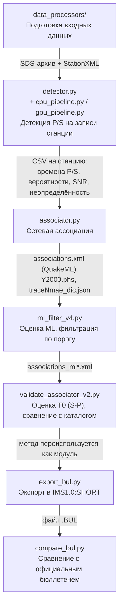
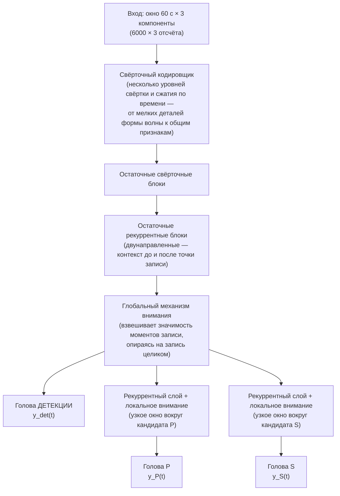
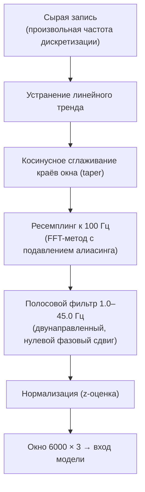
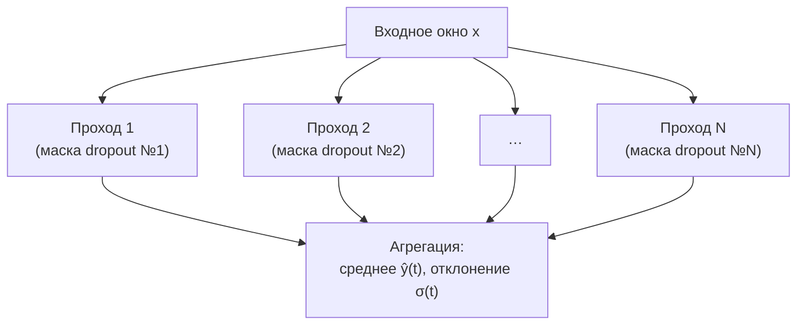
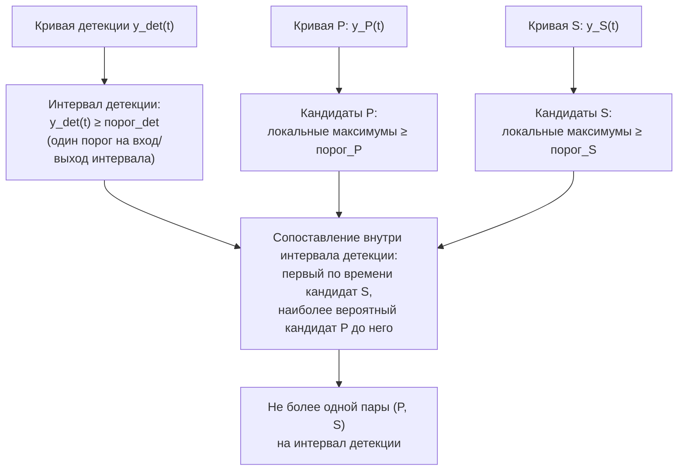
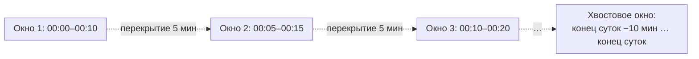
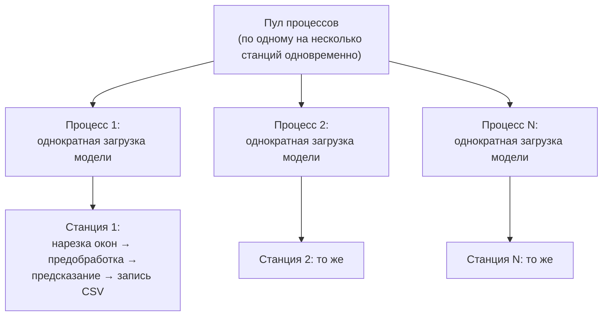
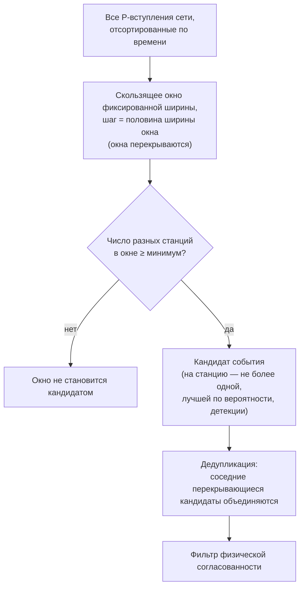
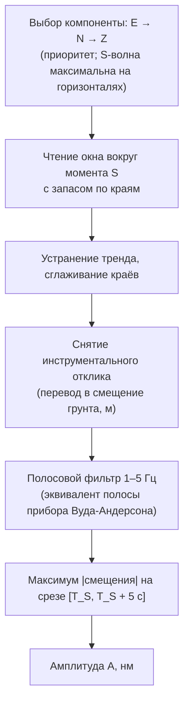
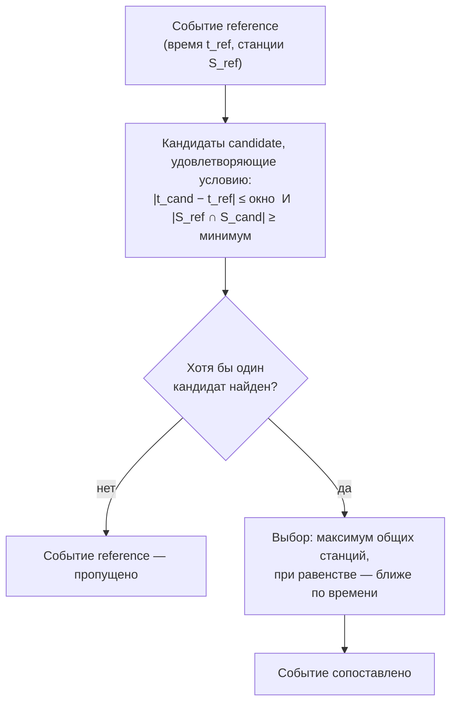

# Метод автоматического обнаружения и оценки параметров сейсмических событий на базе форка EQTransformer

## 0. Назначение документа

Документ описывает алгоритмическую основу автоматического конвейера обработки данных региональной сейсмической сети — от исходных непрерывных записей до бюллетеня событий, сравнимого по форме с официальными бюллетенями ФИЦ ЕГС РАН. Изложение идёт последовательно, модуль за модулем, в порядке фактического прохождения данных по конвейеру, с указанием: что физически измеряется или оценивается на каждом шаге, каким методом, по какой формуле, какие пороги/фильтры применяются и что именно они отсекают.

Документ не содержит исходного кода и не привязан к именам функций или флагам командной строки конкретных скриптов — там, где это осмысленно, указаны названия модулей (файлов) конвейера, поскольку это часть структуры метода, а не деталь реализации.

**Сознательно исключённое.** Проверка метода на официальных бюллетенях НИИ на момент подготовки документа не завершена. Соответственно здесь нет сводных показателей качества метода (recall, точность по времени/магнитуде в среднем по выборке событий и т. п.) как итоговой характеристики. Отдельные числа в тексте (диапазоны калибровки, пороговые значения, размеры используемых обучающих выборок) — это параметры метода и условия его калибровки, а не результаты его применения.

---

## 1. Общая схема конвейера

Обработка данных проходит семь последовательных этапов, реализованных отдельными модулями:



Таблица форматов на стыках модулей:

| Стык | Формат | Содержимое |
|---|---|---|
| SDS-архив → `detector.py` | miniSEED, суточные файлы по станции/каналу | сырые отсчёты грунтового движения по трём компонентам |
| StationXML → `detector.py`/`associator.py` | JSON (координаты + список каналов на станцию) | координаты станций, используемые ассоциатором и позже — для оценки расстояния/региона |
| `detector.py` → `associator.py` | CSV на станцию | по одной строке на обнаруженное вступление: время детекции, времена P/S (если найдены), вероятности, SNR, (опционально) неопределённость MC Dropout |
| `associator.py` → `ml_filter_v4.py` / `validate_associator_v2.py` | QuakeML XML (`associations.xml`) | события с привязанными к ним P/S-пиками по станциям, без гипоцентра |
| `ml_filter_v4.py` → `validate_associator_v2.py` | QuakeML XML (тот же формат, отфильтрованный по ML) | подмножество событий с ML выше заданного порога |
| `validate_associator_v2.py`/`export_bul.py` → `compare_bul.py` | текстовый бюллетень IMS1.0:SHORT (`.BUL`) | время очага, магнитуда (если посчитана), список фаз P/S по станциям |

---

## 2. Подготовка входных данных (`data_processors/`)

### Формат хранения исходных записей

Непрерывные записи хранятся в формате **SDS** (SeisComP Data Structure) — стандартной раскладке каталогов, которую использует SeisComP, ObsPy и большинство сейсмологических сетей:

```
<SDS>/ГОД/СЕТЬ/СТАНЦИЯ/КАНАЛ.ТИП/СЕТЬ.СТАНЦИЯ.ЛОКАЦИЯ.КАНАЛ.ТИП.ГОД.ДЕНЬ_ГОДА
```

Один файл — одна станция, один канал, одни сутки. Модуль `data_processors/geofile_processor.py` рекурсивно обходит архив, конвертирует номер дня года в явные ISO-таймстемпы начала и конца суток и переименовывает файлы в плоскую структуру (один каталог на станцию, без вложенности по годам/каналам):

$$
\texttt{СЕТЬ.СТАНЦИЯ.ЛОКАЦИЯ.КАНАЛ.ТИП.ГОД.ДЕНЬ\_ГОДА} \;\longrightarrow\; \texttt{СЕТЬ.СТАНЦИЯ.ЛОКАЦИЯ.КАНАЛ.ТИП\_\_20240401T000000Z\_\_20240402T000000Z}
$$

Это техническое преобразование, а не изменение данных: значения отсчётов не меняются, меняется только адресация файлов — под явный временной диапазон, который дальше по конвейеру использует детектор.

На этом же шаге действует фильтр по датам: в обработку попадают только файлы, чьи сутки удовлетворяют условию

$$
\text{дата\_начала} \le t < \text{дата\_конца}
$$

(правая граница не включена). Файлы за пределами заданного диапазона, а также файлы с некорректным номером дня в имени, в дальнейшую обработку не копируются.

### Метаданные станций

Метаданные сети (координаты станций, список рабочих каналов, отклик прибора) хранятся в формате **StationXML** (стандарт FDSN). Модуль `data_processors/metadata_processor.py` сводит все XML-файлы сети в единый JSON вида `{код_станции: {сеть, каналы, координаты}}`. Этот JSON используется на всех дальнейших этапах, где нужна геолокация станции — детектором (запись координат в CSV), ассоциатором (проверка физической согласованности по расстоянию), модулем экспорта бюллетеня (определение региона события и отсев нерегиональных станций).

Отдельно, инструментальный отклик станции (из тех же StationXML-файлов) используется позже, на этапе оценки магнитуды (раздел 7) — для перевода записи в физическое смещение грунта.

---

## 3. Нейросетевая модель EQTransformer

### Архитектура

Модель принимает на вход окно записи фиксированной длины 60 секунд (6000 отсчётов при 100 Гц) по трём компонентам:



Три «головы» решают три разные, хотя и связанные задачи, каждая — со своей вероятностной кривой на выходе той же длины, что и входное окно (по одному значению $[0,1]$ на каждый из 6000 отсчётов): «есть ли в этом окне землетрясение» (детекция, взгляд на всю запись — глобальное внимание), «где именно начинается P» и «где именно начинается S» (два независимых узких взгляда — локальное внимание, каждый только вокруг своего кандидата). Веса модели обучены один раз на выборке порядка миллиона размеченных записей (глобальный набор, не региональный) и в этом виде используются без дообучения под данные конкретной сети.

### Предобработка окна перед подачей в модель

Перед вычислением вероятностных кривых запись проходит фиксированную последовательность операций:



Нормализация — это стандартизация (z-оценка) по каждому компоненту записи независимо:

$$
X_{\text{норм}} = \frac{X - \operatorname{mean}(X)}{\operatorname{std}(X) + \varepsilon}
$$

Из окна вычитается его собственное среднее, результат делится на его собственное стандартное отклонение (малая добавка $\varepsilon$ в знаменателе — для устойчивости при почти постоянном сигнале). Смысл шага — привести входы разного физического масштаба (разные станции, разные усиления канала, разные по силе события) к одному диапазону значений, в котором обучалась модель.

**Порядок ресемплинг → фильтрация выбран не случайно.** Полосовой фильтр с верхней границей 45 Гц физически корректен только тогда, когда частота Найквиста записи (половина частоты дискретизации) выше 45 Гц — то есть частота дискретизации должна быть не ниже ~90–100 Гц. Приведение частоты к 100 Гц выполняется до фильтрации именно поэтому: так верхняя граница полосы остаётся физически корректной независимо от исходной частоты дискретизации записи конкретной станции, включая станции сети, пишущие на пониженной частоте.

### Оценка неопределённости (Monte Carlo Dropout)

Внутри модели используются слои с исключением связей (dropout), которые при обычном предсказании отключены — сеть даёт один и тот же детерминированный ответ на один и тот же вход. Оценка неопределённости получается иначе: dropout **намеренно оставляется активным**, и на одном и том же входном окне $x$ модель $N$ раз независимо запрашивается заново, каждый раз со своей случайной маской отключённых связей:



$$
\hat{y}(t) = \frac{1}{N}\sum_{i=1}^{N} y_i(t)
\qquad\qquad
\sigma(t) = \sqrt{\frac{1}{N}\sum_{i=1}^{N} \big(y_i(t) - \hat{y}(t)\big)^2}
$$

Среднее $\hat{y}(t)$ берётся как итоговая вероятность (детекции, P или S — отдельно для каждой из трёх кривых), а стандартное отклонение $\sigma(t)$ — как оценка неопределённости этой вероятности в данной точке записи. Малый разброс между проходами означает, что решение модели устойчиво к случайному отключению части её внутренних связей — высокая уверенность; большой разброс — низкая уверенность. Эта величина неопределённости (для P- и S-пиков отдельно) используется дальше, на этапе ассоциации (раздел 5).

### Извлечение моментов P/S из вероятностных кривых

Три вероятностные кривые (детекция, P, S) по отдельному 60-секундному окну ещё не дают готового «списка событий» — их нужно свести к дискретным моментам:



В сопоставлении участвуют только интервалы детекции длительностью не менее $0.1$ с (10 отсчётов) — более короткие всплески вероятности не рассматриваются как полноценный интервал события.

**Ключевое уточнение о физическом смысле найденного момента.** Момент, извлечённый на этом шаге, — это положение локального максимума **вероятностной кривой**, а не положение максимума амплитуды колебания на исходной записи. Метки обучающей выборки строятся вокруг **момента вступления фазы** — первого заметного отклонения записи от фонового шума при приходе P или S волны, а не вокруг момента наибольшей амплитуды колебания внутри самой фазы. Соответственно найденный моделью пик физически ближе к «моменту начала вступления», чем к «максимальному значению колебания». Это принципиально иной момент, чем тот, что используется позже, отдельно, для оценки магнитуды (раздел 7) — там намеренно измеряется именно максимум амплитуды в фиксированном окне после S-вступления, а не момент вступления. Оба момента лежат на одной и той же записи, но не совпадают друг с другом и решают разные задачи.

---

## 4. Модуль детекции: `detector.py`, `cpu_pipeline.py`, `gpu_pipeline.py`

### Нарезка суточной записи на окна

`detector.py` читает суточные файлы одной станции по всем доступным каналам и нарезает объединённый поток на перекрывающиеся окна длиной 10 минут с шагом 5 минут (перекрытие 50%):



Перекрытие нужно для того, чтобы вступление, попавшее близко к границе одного окна, гарантированно целиком оказалось внутри соседнего окна и не было потеряно или разрезано пополам. Отдельно, после последнего полного шага, добавляется хвостовое окно (последние 10 минут суток) — иначе конец суточной записи мог бы не попасть ни в одно окно из-за целочисленного шага.

Окно передаётся на детекцию, только если в нём физически присутствуют отсчёты не менее чем по двум из трёх компонент станции — распознавание вступления по единственной компоненте не выполняется; интервалы, где работоспособен только один канал, из обработки этого окна исключаются.

Каждое такое 10-минутное окно, в свою очередь, разбивается уже внутри самого предиктора на короткие 60-секундные под-окна — под фиксированный размер входа модели (раздел 3) — и все под-окна одного 10-минутного окна объединяются в один пакетный вызов модели, а не обрабатываются по одному. Это чисто вычислительная оптимизация: батчинг по 10-минутным сегментам вместо вызова модели на каждое 60-секундное под-окно отдельно сокращает число обращений к модели на порядок (с десятков тысяч вызовов на станцию за месяц до нескольких тысяч), что для полного месяца данных на одну станцию превращает счёт из часов в десятки минут.

### Пороги на выходе модели

Для каждого пройденного через модель окна извлечённые кандидаты P/S проходят через пороги вероятности:

| Порог | Действующее значение | Смысл |
|---|---|---|
| порог детекции | $0.75$ | ниже этого значения вероятностная кривая детекции не формирует интервал события |
| порог P | $0.30$ | минимальная вероятность, чтобы локальный максимум $y_P(t)$ считался кандидатом P |
| порог S | $0.20$ | минимальная вероятность, чтобы локальный максимум $y_S(t)$ считался кандидатом S |

Эти значения — не встроенные константы официального пакета EQTransformer, а результат ручной калибровки под региональную сеть: официальный репозиторий модели рекомендует более низкие пороги ($\approx 0.5$ для детекции, $\approx 0.3$ для P/S у используемого набора весов), рассчитанные на минимизацию пропусков в среднем по глобальной обучающей выборке. Более строгий порог детекции, применяемый здесь, — осознанный выбор в пользу меньшего числа ложных срабатываний на данных конкретной сети, за счёт более консервативного отбора. Значения являются настраиваемыми параметрами конвейера и могут быть изменены под конкретную задачу; в таблице приведены значения, действующие на момент подготовки документа.

Отдельно используется ограничение максимального допустимого интервала между кандидатами P и S внутри одного интервала детекции: $\Delta T_{max} = 45$ с. Через ту же формулу пересчёта разности времён P/S в расстояние (раздел 6, коэффициент $k = \dfrac{V_p V_s}{V_p - V_s} \approx 8.33$ км/с) это соответствует физическому ограничению

$$
R_{max} = k \cdot \Delta T_{max} \approx 8.33 \times 45 \approx 375\text{–}380 \text{ км}
$$

Пара P/S, разнесённая по времени сильнее этого предела, физически не может относиться к близко расположенному локальному землетрясению и не рассматривается моделью как валидная пара уже на этом, самом раннем этапе — до всякой сетевой ассоциации.

### Отношение сигнал/шум

Для каждой найденной пары P/S дополнительно вычисляется отношение сигнал/шум (SNR) на записи вокруг найденного момента — количественная мера того, насколько чётко колебание выделяется на фоне окружающего шума. Эта величина используется дальше как один из критериев отбора на этапе стейджинга (раздел 5) и как один из весов при агрегации оценок времени очага по нескольким станциям (раздел 6).

### Результат: CSV на станцию

Для каждой станции пишется один CSV-файл, куда построчно (по мере обработки, не только в конце) добавляется одна строка на каждое найденное вступление: время детекции, время P (если найден), время S (если найден), соответствующие вероятности, SNR, и, если включён режим MC Dropout, — оценки неопределённости для детекции, P и S отдельно (раздел 3).

### Параллельный запуск: `cpu_pipeline.py` / `gpu_pipeline.py`

Сам `detector.py` при прямом запуске обрабатывает список станций последовательно, одним процессом. Для параллельной обработки списка станций используются отдельные обёртки:



Модель загружается один раз на процесс (а не один раз на станцию) — загрузка весов заметно дороже по времени, чем обработка одной станции, поэтому процесс, получив следующую станцию из очереди, переиспользует уже загруженную копию модели. Ошибка на одной станции перехватывается и не останавливает обработку остальных.

`cpu_pipeline.py` и `gpu_pipeline.py` различаются только используемым вычислительным устройством: CPU-версия принудительно скрывает GPU от процесса и ограничивает число потоков TensorFlow на процесс (чтобы параллельные процессы не конкурировали за одни и те же ядра), GPU-версия использует ускоритель и настраивает постепенное выделение видеопамяти. Собственной логики детекции ни один из двух файлов не содержит — оба вызывают тот же самый механизм, что описан выше.

---

## 5. Модуль ассоциации (`associator.py`)

Задача этого модуля — объединить независимые по станциям детекции в кандидатов сетевых событий и отсеять то, что физически не может быть одним и тем же землетрясением. Состоит из двух последовательных шагов: подготовка (стейджинг) и собственно ассоциация.

### Шаг 1 — стейджинг: фильтрация и (опционально) взвешивание детекций

Перед сборкой событий каждая строка CSV детектора (раздел 4) проверяется на соответствие порогам. Пик P засчитывается, если

$$
T_P \neq \varnothing \;\wedge\; p_P \ge P_{THR} \;\wedge\; \big(SNR_P \ge SNR_{THR}\text{, если порог задан}\big),
$$

и аналогично для пика S (с $p_S \ge S_{THR}$). Строка (детекция) в целом проходит стейджинг, если

$$
p_{det} \ge DET_{THR} \;\wedge\; \big(\text{есть и P, и S} \;\vee\; \text{есть хотя бы одна из фаз}\big),
$$

где выбор между «и P, и S» и «хотя бы одна из фаз» — настраиваемый режим.

Учёт неопределённости, полученной MC Dropout (раздел 3), возможен в трёх режимах, различающихся тем, к какой вероятности применяется порог и что записывается дальше:

| Режим | Что подставляется в проверку порога | Что записывается дальше |
|---|---|---|
| без учёта | сырая вероятность $p$ | вероятности как есть |
| «фильтрующий» | эффективная вероятность $p_{\text{эфф}} = p\cdot(1-u)$ | вероятности как есть |
| «взвешивающий» | сырая вероятность (порог не меняется) | вероятности **переписываются** на $p_{\text{эфф}} = p\cdot(1-u)$ — неопределённость не влияет на то, что проходит стейджинг, но снижает вес пика во всех дальнейших вычислениях |

где $u$ — оценка неопределённости этой же вероятности (раздел 3). Смысл — пик, в котором модель сама неуверена (большой разброс между проходами MC Dropout), либо не проходит порог вовсе («фильтрующий» режим), либо проходит, но с меньшим весом при дальнейшей агрегации («взвешивающий» режим).

### Шаг 2 — сборка кандидатов события: скользящее окно по времени P



Окна перекрываются — событие не может «провалиться» между двумя соседними неперекрывающимися интервалами. Поскольку соседние положения окна перекрываются, одно и то же землетрясение почти всегда порождает несколько кандидатов подряд. Два кандидата считаются одним и тем же событием и объединяются, если

$$
|t_1 - t_2| \le \text{шаг} \quad\wedge\quad |S_1 \cap S_2| \ge \max(2,\; n_{min}-1),
$$

где $S_1$, $S_2$ — множества станций двух кандидатов, $n_{min}$ — минимальное число станций для события.

### Шаг 3 — фильтр физической согласованности

Для каждого кандидата события проверяется, что времена прихода P на всех парах входящих в него станций физически совместимы друг с другом:

$$
\big|T_P(A) - T_P(B)\big| \;\le\; \frac{d(A,B)}{V_p} + \tau
$$

где $d(A,B)$ — географическое расстояние между станциями, $V_p$ — скорость P-волны (та же, что используется на этапе оценки расстояния, раздел 6), $\tau$ — небольшой допуск, покрывающий собственную погрешность модели в определении момента P и погрешность скоростной модели. Смысл неравенства — прямое следствие принципа: если разница времён прихода P на двух станциях больше времени, которое реально нужно P-волне, чтобы пройти расстояние между этими станциями (плюс разумный запас на погрешность), то эти две станции физически не могли зафиксировать один и тот же близко расположенный источник.

Если для кандидата находятся станции, нарушающие это условие с кем-то ещё в наборе, — из набора итеративно удаляется станция с наибольшим числом нарушений (при равенстве — с меньшей вероятностью детекции), пока оставшийся набор не станет полностью согласованным или пока станций не станет меньше требуемого минимума (тогда кандидат отбрасывается целиком).

**Практическое значение допуска $\tau$.** Слишком мягкий допуск пропускает в один кандидат станции, которые в действительности зафиксировали два разных, близких по времени события (объединяя их в один «размытый» результат с ухудшенным качеством последующей оценки времени очага и магнитуды); слишком жёсткий допуск начинает разбивать одно реальное событие на несколько кандидатов из-за обычного разброса ошибок пикинга. Диагностика на реальных данных сети подтверждает, что действующее значение допуска обеспечивает чистое разделение близких по времени, но физически разных событий, не теряя при этом в общем числе найденных ассоциаций — точность проявляется именно в чистоте состава станций внутри каждого кандидата.

### Результат

Каждый прошедший оба фильтра кандидат становится событием: время очага на этом этапе — минимум времени P среди подтвердивших станций (грубая оценка, точная оценка времени очага делается позже, раздел 6). Результат пишется в трёх видах: QuakeML-каталог (`associations.xml`) с событиями/пиками, формат фаз hypoInverse (`Y2000.phs`, с координатами первой станции кандидата в качестве технической заглушки координат события — не настоящая локация), и словарь исходных трасс по событию (для последующего извлечения записей, если потребуется, например, для кросс-корреляции).

---

## 6. Оценка времени очага и расстояния без локации (метод S-P)

### Почему нет полноценной локации

Определение координат и глубины очага (локация) требует согласованных направлений на событие с нескольких станций и построения решения методом инверсии по сети. Этот шаг в методе не реализован ни на одном этапе конвейера — ограничение, действующее во всех модулях, начиная с ассоциатора и заканчивая экспортом бюллетеня. Вместо координат метод оценивает только время очага и приблизительное расстояние до каждой отдельной станции.

### Формула расстояния и времени очага по разности P и S

Для станции, где обнаружены и P, и S вступления, разность времён прихода

$$
\Delta T = T_S - T_P
$$

даёт оценку расстояния станция–очаг

$$
R = \frac{V_p V_s}{V_p - V_s}\,\Delta T,
$$

откуда время очага восстанавливается двумя эквивалентными способами:

$$
T_0 = T_P - \frac{R}{V_p} = T_S - \frac{R}{V_s}.
$$

Оба выражения совпадают по построению (это тождество, а не независимая проверка, так как $R$ выведено из той же самой пары $(T_P, T_S)$). Используемые скорости — коровая модель: $V_p = 6.0$ км/с, $V_s = 3.4883$ км/с, что даёт коэффициент $k = \dfrac{V_p V_s}{V_p - V_s} \approx 8.33$ км/с.

### Отбор станций по расстоянию

Станции с оценённым расстоянием $R$ ниже нижнего предела (по умолчанию $20$ км) исключаются из оценки времени очага события целиком: на таких расстояниях P и S ещё недостаточно разделены во времени, и сама линейная зависимость $R(\Delta T)$ вблизи источника ненадёжна. При необходимости может быть дополнительно задан и верхний предел $R$, ограничивающий состав станций дальней границей.

### Отбраковка станций-выбросов

Внутри одного события индивидуальные оценки $T_0$ по разным станциям расходятся — из-за ошибок пикинга P/S, локальных искажений скорости, шума. Применяется статистический фильтр:

$$
\operatorname{med} = \operatorname{median}(T_{0,i}) \qquad
\sigma = \operatorname{std}(T_{0,i} - \operatorname{med})
$$

$$
\text{станция — «нормальная»,} \quad \big|T_{0,i} - \operatorname{med}\big| \le k\sigma \qquad (k \approx 2)
$$

Станции, для которых это неравенство нарушено, считаются выбросами и исключаются из дальнейшего расчёта. Если после отбраковки остаётся меньше минимально допустимого числа станций (обычно 3), фильтр отменяется целиком и используются все исходные станции без исключений — с явной пометкой события как «менее надёжного» (недостаточно станций для устойчивой статистики).

### Объединение оценок нескольких станций в одно время очага

Оценка $T_0$ по единственной станции — самая ненадёжная: одна ошибка пикинга целиком искажает результат. Отфильтрованные оценки объединяются несколькими способами, отличающимися весами ($N$ — все станции, $M$ — станции, прошедшие $\sigma$-фильтр, $p_i$ — вероятность пика P на станции $i$, $\mathrm{SNR}_i$ — отношение сигнал/шум на этой же станции):

$$
T_0^{\min} = T_{0,\,j}, \quad j = \arg\min_i \Delta T_i \qquad\text{(ближайшая станция)}
$$

$$
T_0^{\text{raw}} = \frac{1}{N}\sum_{i=1}^{N} T_{0,i} \qquad\text{(среднее по всем, без фильтра)}
$$

$$
T_0^{\text{mean}} = \frac{1}{M}\sum_{i=1}^{M} T_{0,i} \qquad\text{(среднее по станциям, прошедшим $\sigma$-фильтр)}
$$

$$
T_0^{\text{wmean}} = \frac{\displaystyle\sum_i T_{0,i}\big/\Delta T_i^{\,2}}{\displaystyle\sum_i 1\big/\Delta T_i^{\,2}} \qquad\text{(вес $\sim$ обратный квадрат $\Delta T$)}
$$

$$
T_0^{\text{probw}} = \frac{\displaystyle\sum_i T_{0,i}\, p_i}{\displaystyle\sum_i p_i} \qquad\text{(вес — вероятность пика P)}
$$

$$
T_0^{\text{probsnr}} = \frac{\displaystyle\sum_i T_{0,i}\, p_i\, \mathrm{SNR}_i}{\displaystyle\sum_i p_i\, \mathrm{SNR}_i} \qquad\text{(вес — вероятность $\times$ SNR)}
$$

Взвешивание по произведению вероятности пика и отношения сигнал/шум ($T_0^{\text{probsnr}}$) физически обосновано следующим образом: момент вступления, извлечённый моделью (раздел 3), не всегда в точности совпадает с истинным началом фазы — при слабом или зашумлённом сигнале вероятностная кривая модели нарастает постепенно, и точка, где она впервые уверенно превышает порог, может оказаться смещена относительно истинного момента вступления. Эта погрешность заметнее на записях с низким отношением сигнал/шум и низкой уверенностью модели — то есть именно там, где веса $p_i$ и $\mathrm{SNR}_i$ малы. Поскольку ошибка в определении $T_P$ входит в оценку расстояния $R$ (и тем самым в $T_0$) с коэффициентом

$$
\frac{V_p}{V_p - V_s} \approx 2.4,
$$

небольшое смещение момента P на записи с плохим качеством сигнала даёт заметно увеличенное смещение итоговой оценки времени очага для этой станции. Взвешивание по $p \cdot \mathrm{SNR}$ понижает вклад именно таких, потенциально смещённых станций, не отбрасывая их совсем (в отличие от жёсткого порогового отбора).

Взвешивание по обратному квадрату расстояния ($T_0^{\text{wmean}}$) на практике оказывается менее эффективным, чем можно было бы ожидать: близость станции к очагу сама по себе не гарантирует более точный пик модели — качество определения момента вступления определяется прежде всего чистотой записи и уверенностью модели, а не одним лишь расстоянием.

### Сравнение с эталонным каталогом

Помимо оценки $T_0$, этот же метод сопоставляет каждое событие эталонного каталога с ближайшей по времени ассоциацией сети: подходящей считается ассоциация, чья оценка $T_0$ отличается от каталожного времени не более чем на заданный допуск (по умолчанию $60$ с). Дополнительно может быть задано минимальное число подтверждающих станций — по общему числу станций, вошедших в ассоциацию, либо только по числу станций, прошедших $\sigma$-фильтр (см. выше). Если у ближайшей по времени ассоциации станций недостаточно, каталожное событие считается ненайденным, даже если оно ближе всего по времени. Тот же принцип сопоставления (окно допуска по времени плюс требование по общим станциям) используется и на уровне готовых бюллетеней — см. раздел 9.

---

## 7. Оценка локальной магнитуды (`ml_filter_v4.py`)

### Формула

Используется формула локальной магнитуды $ML$, откалиброванная для Терско-Каспийского прогиба (Дягилев, Габсатарова, Селиванова, 2023) по 64 землетрясениям 2020–2022 гг., записанным 58 станциями на расстояниях 25–526 км:

$$
ML_i = \lg A_i + a\lg R_i + bR_i + c + S_i
$$

где для станции $i$: $A_i$ — максимальная амплитуда S-волны (нм, измеряется отдельно, см. ниже), $R_i$ — расстояние станция–очаг, оценённое методом S-P (раздел 6, км), а коэффициенты

$$
a = 1.024, \qquad b = 0.001648 \text{ км}^{-1}, \qquad c = -1.889,
$$

получены калибровкой по региональным данным; $S_i$ — станционная поправка (по умолчанию $0$, см. ниже).

Физический смысл каждого члена:

| Член | Физический механизм |
|---|---|
| $\lg A_i$ | логарифмическая шкала силы толчка — рост на единицу магнитуды соответствует примерно десятикратному росту амплитуды записи |
| $a \lg R_i$ | геометрическое расхождение волнового фронта с расстоянием |
| $b R_i$ | неупругое поглощение энергии средой (экспоненциальное затухание, линейное в логарифмическом масштабе) |
| $c$ | свободный член калибровки, приводящий формулу к опорной точке шкалы |
| $S_i$ | локальная поправка на грунтовые условия под конкретной станцией |

Оба коэффициента поправки на расстояние ($a$, $b$) откалиброваны на реальных региональных землетрясениях, а не заимствованы из общей теории затухания.

### Измерение амплитуды $A$

Амплитуда измеряется на той же самой записи, но иным способом и в иной момент, чем пикинг P/S (раздел 3):



Таким образом, момент, использованный для магнитуды (окно после найденного S-вступления), заведомо более поздний, чем сам момент S-вступления, и ищет не начало колебания, а его максимум внутри окна — что и отличает эту величину от пикинга, описанного в разделе 3.

### Станционная поправка $S$

Механизм поправки на локальные грунтовые условия реализован (одна и та же по силе волна на разных станциях записывается по-разному из-за характеристик грунта под сейсмометром — мягкие осадочные породы способны усиливать колебания сильнее, чем скальное основание). Механизм остаётся доступным и может быть подключён при появлении актуальной калибровки, но сейчас сознательно не используется.

### Отбор станций и агрегация оценок по событию

До статистической агрегации отсекаются физически невалидные точки: станции с оценённым расстоянием $R < 20$ км (область, где формула, калиброванная на больших расстояниях, нелинейна и ненадёжна) или $R > 600$ км (за пределами диапазона, на котором калибровалась формула), с амплитудой ниже уровня артефактов измерения ($A < 0.005$ нм) или физически невозможно большой ($A > 10^6$ нм — свыше миллиметра смещения грунта).

Если после отсева осталось меньше 4 станций — магнитуда для события не вычисляется (лучше не иметь оценки, чем иметь её по недостаточному числу станций).

Дальше применяется статистическая фильтрация выбросов и усреднение по оставшимся станциям:

$$
M_{\text{med}} = \operatorname{median}(ML_1, \dots, ML_N) \qquad
\sigma = \operatorname{std}(ML_1, \dots, ML_N)
$$

$$
\big|ML_i - M_{\text{med}}\big| \le 1.5\,\sigma \;\Longrightarrow\; \text{станция учитывается, иначе — отбрасывается как выброс}
$$

$$
ML_{\text{события}} = \frac{1}{M}\sum_{i \in \text{учтённые}} ML_i
$$

Медиана (а не среднее) используется как центр распределения именно потому, что она устойчива к единичным выбросам: если одна станция даёт заметно завышенную оценку, а остальные согласуются между собой, медиана останется на уровне согласованной группы, тогда как среднее сдвинулось бы к выбросу. После отбраковки выбросов, когда оставшиеся оценки уже близки друг к другу, для финального числа используется среднее — оно точнее медианы при уже симметричном, «очищенном» распределении. Если отбраковка снова оставляет меньше 4 станций — она отменяется, берутся все исходные станции без исключений.

### Оговорка о происхождении расстояния в формуле

Формула в оригинальной публикации калибровалась на гипоцентральном расстоянии, полученном из полноценной локации события. В этом методе такого расстояния нет — вместо него в ту же формулу подставляется расстояние, оценённое методом S-P (раздел 6), то есть физически иная, хотя и содержательно близкая величина. Это осознанная и обоснованная замена входа формулы, но не буквальное повторение условий оригинальной калибровки — при интерпретации значений ML это стоит держать в уме.

---

## 8. Экспорт бюллетеня (`export_bul.py`)

Модуль формирует итоговый бюллетень в формате **IMS1.0:SHORT** — том же визуальном формате, в котором публикуются официальные бюллетени ГС РАН, — по всем событиям, прошедшим предыдущие фильтры (без сравнения с эталонным каталогом; это отличает его от валидации, раздел 6, — тот же метод оценки T0/ML переиспользуется, но здесь результат не проверяется на совпадение с каталогом, а просто экспортируется).

### Отсев нерегиональных станций

Во входных данных вперемешку с региональной сетью присутствуют отдельные опорные станции, расположенные на значительном удалении (за пределы разумной дальности для регионального события). Перед расчётом T0/ML такие станции отсеиваются по расстоянию до опорной точки региона (по умолчанию — окрестность города Сочи, как географического центра сети), вычисленному по формуле большого круга (haversine):

$$
d = 2r \arcsin\!\left(\sqrt{\sin^2\!\frac{\varphi_2-\varphi_1}{2} + \cos\varphi_1\cos\varphi_2\,\sin^2\!\frac{\lambda_2-\lambda_1}{2}}\right)
$$

где $\varphi$, $\lambda$ — широта и долгота станции и опорной точки, $r$ — радиус Земли. Станция исключается из расчёта события, если $d > 800$ км. Расстояние считается по географическим координатам, а не по названию или принадлежности к сети — это исключает случайное совпадение по формальному признаку (например, по коду сети) там, где станция физически находится близко, но названа нетипично.

### Определение региона события

Поле региона в заголовке бюллетеня заполняется по административному региону **ближайшей к событию станции** (из её метаданных StationXML) — не по вычисленному эпицентру, которого нет.

### Содержимое бюллетеня

```
DATA_TYPE BULLETIN IMS1.0:SHORT
...
EVENT <идентификатор> <регион>
  строка гипоцентра   — только время очага; широта/долгота/глубина
                         и всё, что от них производно (эллипс ошибки,
                         азимутальный охват сети, невязка) — не заполняются
  строка магнитуды    — только если ML успешно посчитана
  строки фаз          — по одной P и/или S фазе на подтвердившую станцию
...
STOP
```

Явно заполняются только те поля, для которых метод реально вычисляет значение: время очага, число станций, магнитуда (когда посчитана), список фаз с их временами, SNR и амплитудами. Поля, производные от координат события, остаются пустыми не по недосмотру, а потому что метод их не вычисляет ни на каком этапе (раздел 6).

---

## 9. Сравнение бюллетеней (`compare_bul.py`)

Модуль сопоставляет итоговый бюллетень метода с внешним эталонным бюллетенем (обычно — официальным бюллетенем ГС РАН) напрямую по тексту `.BUL`-файлов, без обращения к промежуточным XML/CSV конвейера.

### Алгоритм сопоставления



Формально кандидат допускается к рассмотрению, если

$$
\big|t_{\text{cand}} - t_{\text{ref}}\big| \le W \qquad\wedge\qquad \big|S_{\text{ref}} \cap S_{\text{cand}}\big| \ge n_{\min},
$$

где $W$ — временное окно допуска (по умолчанию 60 с), $n_{\min}$ — минимум общих станций.

Сопоставление не эксклюзивно: один и тот же кандидат может быть признан «лучшим совпадением» сразу для нескольких разных эталонных событий, если они расположены близко по времени — это стоит учитывать при интерпретации результата сравнения на плотных по времени последовательностях событий (афтершоковые серии).

По результатам сравнения формируется список найденных и пропущенных событий эталонного бюллетеня, с расхождением по времени и составом станций для найденных.

---

## 10. Почему часть событий не находится принципиально

Главная физическая причина систематических пропусков — **направленность излучения** при землетрясении: энергия разрыва расходится в пространстве неравномерно, в зависимости от геометрии самого разрыва (механизма очага). Для одного и того же события амплитуда сигнала на разных станциях может отличаться не только из-за разного расстояния, но и из-за того, в каком направлении относительно очага расположена конкретная станция.

Следствие: если станции, ближе всего расположенные к событию, оказались в направлении слабого излучения (в узловой плоскости диаграммы направленности), а станция, зафиксировавшая событие чётко, — единственная и находится дальше остальных, то событие может не набрать требуемого минимального числа согласованных подтверждений (раздел 5) и не пройти в итоговый список — даже при том, что формально хотя бы одна станция его правильно обнаружила. Это не следствие неверно подобранных порогов, а прямое следствие недостаточности данных: набора станций, реально «увидевших» это конкретное событие, физически меньше требуемого минимума.

**Разобранный случай.** По одному конкретному событию единственная станция дала верное обнаружение с корректным временем очага. Ещё несколько станций, расположенных заметно ближе к предполагаемому очагу, в то же примерное время зафиксировали, по всей видимости, другое, постороннее событие — их индивидуальные оценки времени очага были заметно смещены относительно правильного значения. Правдоподобное объяснение — эти близкие станции оказались в направлении слабого излучения нужного события и вместо него зарегистрировали более заметный по амплитуде сигнал соседнего землетрясения. Ни фильтр физической согласованности (раздел 5), ни статистическая отбраковка выбросов при оценке времени очага (раздел 6) эту ситуацию не устраняют: единственная станция с правильным сигналом физически не может одна набрать требуемый минимум подтверждающих станций, а близкие станции указывают не на шум (который можно отфильтровать статистически), а на другое реальное событие. Единственное, что принципиально решило бы такой случай, — полноценная локация по нескольким станциям, которой в методе нет.

Такие пропуски — отражение физического предела подхода «время очага по одним лишь P/S-вступлениям, без локации», а не результат неудачно подобранных порогов детекции или ассоциации.

---

## 11. Сводные ограничения метода

- **Локации (координат и глубины очага) нет ни на одном этапе конвейера.** Метод оценивает время очага и расстояние до каждой отдельной станции, но не строит совместное решение по нескольким направлениям. Это архитектурное ограничение текущей версии, а не временный пробел.
- **Модель не переобучалась под данные региона.** Используются веса, обученные один раз на большом глобальном наборе записей; перенос на новый регион без дообучения — заявленное свойство модели, отдельно не измеренное на данных именно этой сети в рамках настоящего документа.
- **Станционные поправки магнитуды сейчас отключены** ($S_i = 0$) — не из-за отсутствия механизма, а из-за признанной неактуальности имеющегося набора калибровочных значений (раздел 7).
- **Пороговые значения (детекции, P/S, физической согласованности) — результат ручной калибровки под конкретную сеть**, а не значения по умолчанию из документации исходной модели; они настраиваются как параметры конвейера и могут со временем пересматриваться.
- **Расстояние в формуле магнитуды — не гипоцентральное расстояние из локации**, а оценка методом S-P (раздел 6), физически близкая, но не идентичная величине, на которой калибровалась исходная формула.
- **Часть пропусков событий физически неустранима** текущей архитектурой метода (раздел 10) — направленность излучения и невыгодное расположение станций относительно конкретного события не лечатся подбором порогов и требуют полноценной локации, которой в методе нет.
- **Ручной верификации результатов нет.** Все события в итоговом бюллетене — полностью автоматические, без просмотра оператором.
- **Итоговые показатели качества метода (recall, точность по времени очага и магнитуде) в этом документе намеренно не приводятся** — сверка с официальными бюллетенями НИИ на момент подготовки документа не завершена.
