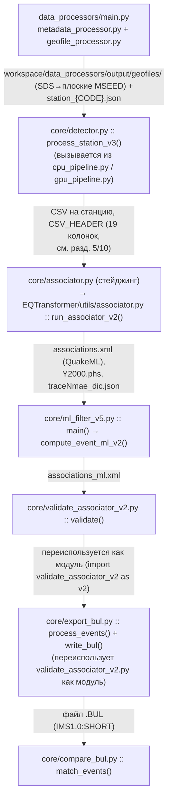
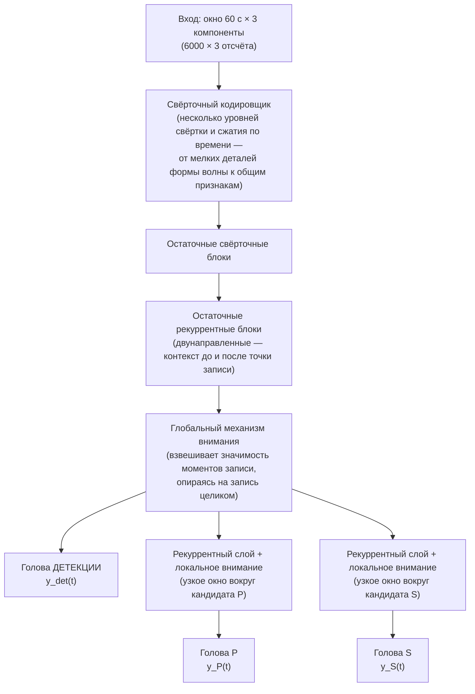
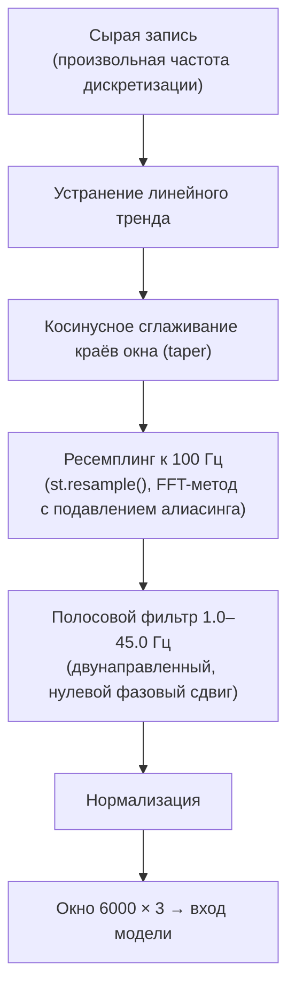
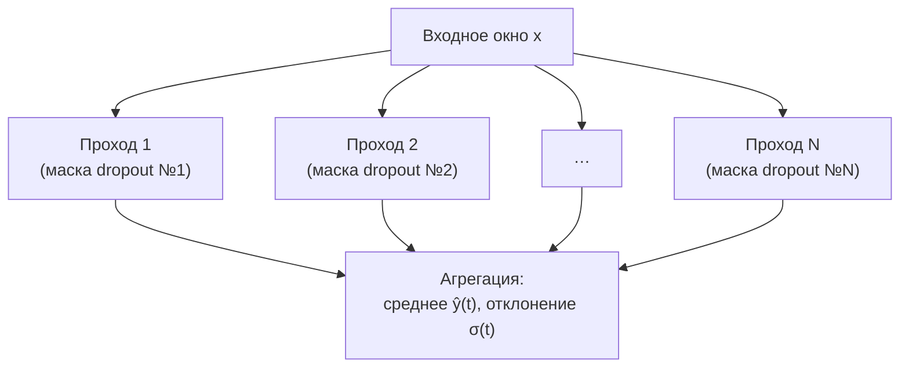
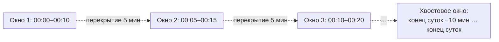
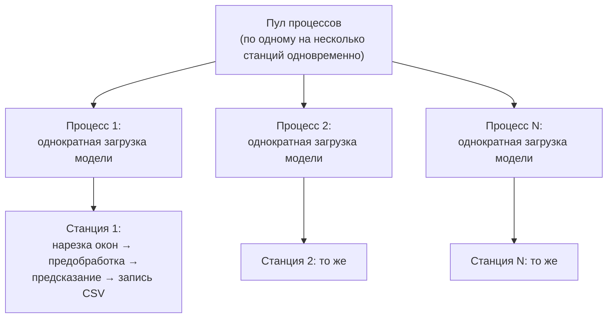
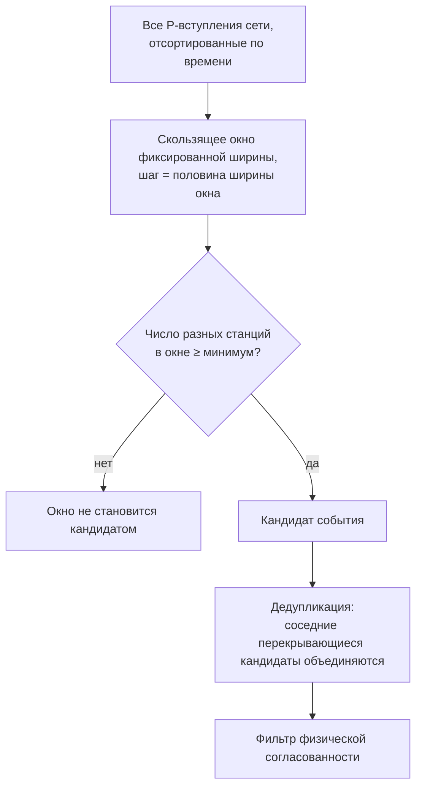
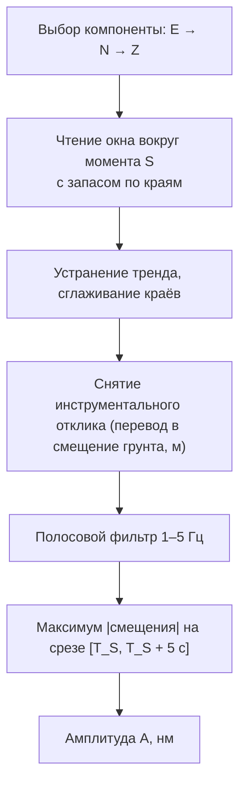
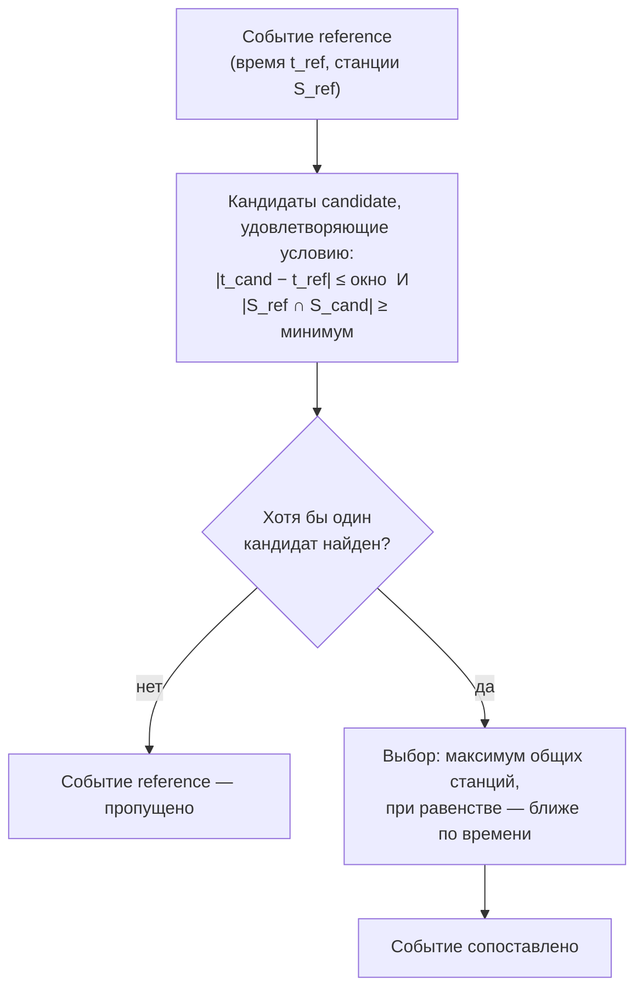

# Техническое описание пайплайна автоматического обнаружения сейсмических событий (форк EQTransformer)

## 0. Назначение документа и границы

Документ адресован разработчикам, сопровождающим или расширяющим этот пайплайн — людям, уверенно читающим код, но не обязательно разбирающимся в сейсмологии. Он покрывает: архитектуру кода (какой модуль что вызывает и в каком порядке), реальные форматы файлов и полей на каждом стыке конвейера, конфигурацию и CLI-флаги там, где они есть, и особенности реализации, важные для эксплуатации и поддержки — включая известные несоответствия докстрингов реальному поведению, гонки при параллельной записи и места, где независимые реализации одной и той же формулы дают не идентичный результат.

Документ **не** ставит задачей глубокую физическую интерпретацию метода (вывод формул из физики распространения волн, обоснование скоростных моделей и т. п.) — акцент сделан на архитектуре кода и форматах данных; необходимый минимум физики, без которого пороги и формулы ниже не будут понятны, изложен прямо здесь же (разд. 2).

Здесь намеренно нет сводных показателей качества метода (recall, точность по времени/магнитуде) — сверка с официальными бюллетенями НИИ на момент подготовки документа не завершена. Приведены только параметры калибровки, пороги и константы конфигурации.

---

## 1. Общая схема пайплайна

Обработка данных проходит семь последовательных этапов, реализованных отдельными модулями; ниже — реальные точки входа в код и полные форматы на стыках:



Расширенная таблица форматов на стыках (полные поля — см. разд. 10, сводная таблица):

| Стык | Формат | Ключевые поля |
|---|---|---|
| SDS-архив → `data_processors/geofile_processor.py` | miniSEED, `NET.STA.LOC.CHAN.TYPE.YEAR.DAY` | суточные файлы, один канал |
| `geofile_processor.py` → `detector.py` | miniSEED, переименованные в `..._\_\_start\_\_end` | те же данные, явные ISO-таймстемпы в имени файла, `workspace/data_processors/output/geofiles/` |
| `metadata_processor.py` → все модули с геолокацией | JSON `{STA: {network, channels, coords:[lat,lon,elv]}}` | ⚠️ разрыв формата: `main.py` пишет один агрегированный `workspace/data_processors/output/station_list_RU.json`, а детектор/ассоциатор читают отдельные `station_{CODE}.json` той же схемы — см. `data_processors/README.md` |
| `detector.py::process_station_v3` → `associator.py` | CSV, `CSV_HEADER` (19 колонок) | `event_start_time/end_time`, `p_arrival_time`/`s_arrival_time` + вероятности/SNR/uncertainty |
| `associator.py` (стейджинг) → `run_associator_v2` | CSV `X_prediction_results.csv`, те же 19 колонок (отфильтрованное подмножество строк, в режиме `weight` — с переписанными вероятностями) | — |
| `run_associator_v2` → `ml_filter_v5.py`/`validate_associator_v2.py` | QuakeML `associations.xml` (`Event`/`Origin(time only)`/`Pick(phase_hint=P\|S)`) + `Y2000.phs` (hypoinverse) + `traceNmae_dic.json` | `publicID` (`smi:local/...`, авто от ObsPy), `waveform_id.station_code` |
| `ml_filter_v5.py` → `validate_associator_v2.py`/`export_bul.py` | QuakeML, тот же формат, отфильтрованный по ML | — |
| `validate_associator_v2.py`/`export_bul.py` → `compare_bul.py` | `.BUL` (IMS1.0:SHORT, фиксированные колонки) | `Date[1:10]`, `Time[12:22]`, `Sta[0:5]` |

---

## 2. Минимальный доменный ликбез

Землетрясение излучает как минимум два типа объёмных волн, распространяющихся с разной скоростью: продольная **P** (быстрее, приходит первой) и поперечная **S** (медленнее). Каждая сейсмическая станция сети физически измеряет одно и то же — смещение/скорость грунта во времени, обычно по трём ортогональным компонентам (одна вертикальная, две горизонтальные, условно Z/N/E) — то есть на выходе станции всегда три параллельных временных ряда, а не одно число.

Чем дальше станция от очага, тем позже (в абсолютном времени) до неё доходят P и S, и тем больше становится разница времён их прихода $\Delta T = T_S - T_P$ — обе волны расходятся от одной точки, но с разной скоростью, поэтому чем дольше они «путешествуют», тем сильнее расходятся во времени. Этот факт — единственное, что нужно знать на данном этапе, чтобы дальше в документе были понятны пороги вида «интервал между кандидатами P и S не больше 45 с» (разд. 5) или формула расстояния через $\Delta T$ (разд. 7): все они — прямое следствие того, что P и S — разные волны с разной, но известной скоростью.

Помимо времени прихода, амплитуда колебания на записи несёт информацию о силе толчка (разд. 8) — чем сильнее событие, тем больше физическое смещение грунта, при прочих равных условиях (расстояние, тип грунта под станцией).

---

## 3. Подготовка данных (`data_processors/`)

### Оркестрация: `main.py`

`data_processors/main.py` запускается из корня репозитория (`python data_processors/main.py`; пути внутри — `workspace/...`, всегда резолвятся от корня через `_ROOT`, не от текущей рабочей директории) и координирует два независимых шага. Каждый шаг выполняется только если **все** нужные ему пути уже существуют — сам `main.py` ничего не создаёт:

```python
metadata_xml_folder_path     = workspace/data_processors/input/metadata
json_stationlist_output_path = workspace/data_processors/output/station_list_RU.json
geofile_input_directory      = workspace/data_processors/input/raw
geofile_output_directory     = workspace/data_processors/output/geofiles
```

**Шаг 1 (метаданные)** запускается при условии `metadata_xml_exist`. `combine_inventories_to_json()` открывает выходной файл в режиме `'w'` — создаёт его сам, если директория назначения существует.

⚠️ **Разрыв формата:** этот шаг вызывает `combine_inventories_to_json()` один раз на всю папку метаданных и пишет **один** агрегированный JSON. Но `detector.py`/`associator.py`/`sta_correction_estimator.py` (разд. 5–8) читают **отдельный файл на станцию** (`station_{CODE}.json`, та же схема с одним ключом) через `--json-dir` — этот шаг `main.py` сейчас не производит то, что реально потребляет остальной пайплайн; на практике файлы `station_{CODE}.json` готовятся отдельно от этого скрипта.

**Шаг 2 (сейсмические файлы)** запускается, если существуют обе директории — входная и выходная. Список станций не задаётся вручную: `get_directories()` возвращает имена всех подпапок первого уровня во входной SDS-директории (это и есть коды станций) и передаёт их в `geofile_processor()`.

Если какое-то условие не выполнено, скрипт печатает, какого пути не хватает (`"XML"`/`"INPUT"` и т. п.), и переходит к следующему шагу — выполнение не прерывается.

### `geofile_processor.py`

Формула фильтра по датам и преобразование имени файла:

$$
\texttt{СЕТЬ.СТАНЦИЯ.ЛОКАЦИЯ.КАНАЛ.ТИП.ГОД.ДЕНЬ\_ГОДА} \;\longrightarrow\; \texttt{СЕТЬ.СТАНЦИЯ.ЛОКАЦИЯ.КАНАЛ.ТИП\_\_20240401T000000Z\_\_20240402T000000Z}
$$

$$
\text{дата\_начала} \le t < \text{дата\_конца}
$$

Диапазон дат — константы вверху файла, не параметр функции:

```python
date_from = datetime(2024, 4, 1)
date_to   = datetime(2024, 6, 1)   # не включается
```

Механика: для каждой станции создаётся выходной каталог (`os.makedirs(..., exist_ok=True)`); входной каталог станции обходится рекурсивно (`os.walk` — подхватывает файлы из любых вложенных подпапок, не только верхнего уровня); номер дня в году берётся как последняя точечная часть имени файла (`file_name.split('.')[-1]`), проверяется на диапазон `1–365`; год для пересчёта даты берётся **из константы `date_from`, а не из имени файла**; итоговая копия — `shutil.copy2` в плоский каталог назначения. Переменная `folder_name = os.path.basename(root)`, вычисляемая при обходе, нигде не используется — вложенная структура при копировании не сохраняется.

### `metadata_processor.py`

Выходной JSON — один файл на всю сеть:

```json
{
  "SOC": {
    "network": "RU",
    "channels": ["BHE", "BHN", "BHZ"],
    "coords": [43.57, 39.763, 54.0]
  }
}
```

`read_inventory_file(file_path)` строит `{station_code: {...}}` из одного XML со следующими особенностями, важными для эксплуатации:
- код станции берётся как `network.stations[0].code` — то есть ключ определяется **первой** станцией сети в этом XML, даже если в сети (в этом конкретном файле) их несколько;
- `coords` перезаписываются на каждой итерации внутреннего цикла по станциям сети — в результат попадают координаты **последней** станции цикла, не обязательно той, чей код стал ключом;
- список каналов фильтруется условием `channel.start_date >= last_date`, где `last_date` — start_date **последнего по порядку в XML** канала (а не максимум по всем каналам, цикл просто перезаписывает переменную) — при непредсказуемом порядке каналов в файле результат зависит от их фактического порядка.

Из-за этих трёх особенностей модуль рассчитан на XML с ровно одной станцией на сеть (типичный экспорт FDSN station-service по станции) — на многостанционных XML координаты и каналы разных станций могут перемешаться под одним ключом.

`combine_inventories_to_json(xml_folder_path, json_output_path)` обходит все `*.xml` в папке (`os.listdir`, без рекурсии по подпапкам): для новой станции данные добавляются целиком, для уже встреченной — `channels` дополняется через `extend` **без дедупликации** (возможны повторы), а `coords` не обновляется — остаётся от первого встреченного файла для этой станции. Результат пишется через `json.dump(..., indent=4)`; при отсутствии выходной директории перехватывается `FileNotFoundError` с понятным сообщением.

Готовый JSON используется дальше детектором (запись координат в CSV) и ассоциатором (проверка физической согласованности по расстоянию, разд. 6).

---

## 4. Нейросетевая модель EQTransformer

### Архитектура



В коде (`EQTransformer/core/EqT_utils.py::cred2`) это: `_encoder` (7 слоёв Conv1D+MaxPooling1D) → 5 CNN-резидуальных блоков (`_block_CNN_1`) → 3 BiLSTM-резидуальных блока (`_block_BiLSTM`) → глобальное внимание (`_transformer('attentionD0')` → `_transformer('attentionD')`, `attention_width=None` — по всей длине) → от общего `encoded` отходят: `_decoder` → `Conv1D(sigmoid)` для детекции, и два независимых ответвления `LSTM → SeqSelfAttention(width=3) → _decoder` для P и S (`attention_width=3` — буквально узкое окно ±3 отсчёта, а не вся запись). Веса (`EqT_original_model.h5`) обучены один раз на STEAD (~1 млн записей, ~450 тыс. событий, глобальное распределение, эпицентральные расстояния до 300 км) и используются как есть, без переобучения под региональную сеть.

Файлы, отвечающие за это в проекте: `EQTransformer/core/EqT_utils.py` (сама архитектура `cred2`, `picker`, не модифицируется форком), `EQTransformer/core/predictor.py` (обёртка над загруженной моделью, реализующая батчевый вызов модели и MC Dropout — `predictor_mem_non_hdf_load_model_v6`), `EQTransformer/utils/hdf5_maker.py` (предобработка — `preprocessorV7_mem`).

### Предобработка окна перед подачей в модель

Перед вычислением вероятностных кривых запись проходит фиксированную последовательность операций (`preprocessorV7_mem`):



Ресемплинг выполняется до фильтрации — так верхняя граница полосы (45 Гц) остаётся физически корректной независимо от исходной частоты дискретизации станции: после ресемплинга частота всегда 100 Гц (Найквист 50 Гц), и `freqmax=45` Гц всегда ниже Найквиста. Нормализация (`predictor_mem_non_hdf_load_model_v6`) — деление окна на его собственное стандартное отклонение по каждому компоненту независимо:

$$
X_{\text{норм}} = \frac{X}{\operatorname{std}(X)}
$$

Смысл — привести входы разного физического масштаба (разные станции, разные усиления канала, разные по силе события) к одному диапазону значений, в котором обучалась модель.

### Оценка неопределённости (MC Dropout)



$$
\hat{y}(t) = \frac{1}{N}\sum_{i=1}^{N} y_i(t)
\qquad\qquad
\sigma(t) = \sqrt{\frac{1}{N}\sum_{i=1}^{N} \big(y_i(t) - \hat{y}(t)\big)^2}
$$

В Keras dropout по умолчанию отключён на инференсе (`model.predict()` не активирует его) — это стандартное поведение фреймворка. `predictor_mem_non_hdf_load_model_v6` реализует MC Dropout по-настоящему: внутренняя `_mc_forward` вызывает `model(batch, training=True)` — dropout физически активен, `number_of_sampling` независимых проходов дают распределение, откуда берутся `mean`/`std`. Параметры `estimate_uncertainty`/`number_of_sampling` пробрасываются от `process_station_v3()` до предиктора и в текущих рабочих прогонах всегда включены — оценка неопределённости считается для каждой станции, не только по запросу. Реализация батчит все `number_of_sampling` копий окна в один `tf.function`-вызов, а не делает `number_of_sampling` последовательных вызовов (оптимизация скорости, результат тот же).

### Извлечение пиков (`EqT_utils.py::picker`)

Интервал детекции извлекается через `trigger_onset(yh1, detection_threshold, detection_threshold)` — на вход и выход интервала действует один и тот же порог. Кандидаты P/S — локальные максимумы вероятностной кривой: `_detect_peaks(yh2, mph=P_threshold, mpd=1)` и аналогично для S — минимальное расстояние между пиками 1 отсчёт, то есть отбираются практически все локальные максимумы выше порога, не один глобальный. Сопоставление P/S внутри одного интервала детекции (не короче 10 отсчётов, 0.1 с) — не более одной пары на интервал: первый по времени кандидат S, наиболее вероятный кандидат P до него.

### Пороги: наши значения vs официальные рекомендации

Официальный репозиторий (`github.com/smousavi05/EQTransformer`) поставляет две модели с разными рекомендованными порогами:

| Модель | Рекомендуемые пороги (README оригинала) |
|---|---|
| `EqT_original_model.h5` («original») | детекция ≈ 0.5, P/S ≈ 0.3 |
| «conservative» | ≈ 0.03 для всех |

Дефолты в самих сигнатурах оригинального `predictor()`/`mseed_predictor()` — `detection_threshold=0.3, P_threshold=0.1, S_threshold=0.1`, ниже даже официальной рекомендации для «original». Наш `core/detector.py` использует веса `EqT_original_model.h5`, но жёстко задаёт `detection_threshold=0.75, P_threshold=0.3, S_threshold=0.2` — детекция выше даже рекомендации для этой модели, `P_threshold` совпадает с рекомендацией, `S_threshold` — между «original» и «conservative». Это выглядит как осознанная ручная калибровка под региональную сеть (более строгий отбор, меньше ложных детекций на конкретных станциях), а не ошибка, но это явное отклонение от документации оригинала, о котором стоит знать при сравнении поведения с апстримом.

---

## 5. Модуль детекции: `core/detector.py`, `core/cpu_pipeline.py`, `core/gpu_pipeline.py`

### Нарезка на сегменты



В коде это `geofile_splitter_multi_chanels_v3` (генератор, `yield`, не список; обрабатывает файлы одной станции по очереди, не держит в памяти весь месяц) — единственная версия в `core/detector.py`: более старая `_v2` вместе со всей legacy-цепочкой обработки удалена, см. ниже. Файлы находятся регэкспом `NET.STA.LOC.CHA__start__end`, группируются по ключу `{STA}_{start}` (все каналы одного суточного файла в одну группу), группа с менее чем 2 каналами после чтения пропускается, поток нарезается на 10-минутные окна с шагом 5 минут (`window_length=600s`, `step=300s`), хвостовое окно добавляется отдельно после последнего полного шага. `st_all` явно удаляется (`finally: del st_all`) после каждой группы — пиковое потребление памяти: один суточный поток + один сегмент в обработке.

### Пороги на выходе модели

| Порог | Действующее значение | Смысл |
|---|---|---|
| порог детекции | $0.75$ | ниже этого значения интервал детекции не формируется |
| порог P | $0.30$ | минимальная вероятность для кандидата P |
| порог S | $0.20$ | минимальная вероятность для кандидата S |

$$
\Delta T_{max} = 45\text{ с} \;\Rightarrow\; R_{max} = k \cdot \Delta T_{max} \approx 8.33 \times 45 \approx 375\text{–}380 \text{ км}
$$

Эти пороги (`detection_threshold=0.75, P_threshold=0.3, S_threshold=0.2`), а также `keepPS=True, allowonlyS=False, spLimit=45, batch_size=32` — зашиты **внутри тела** `worker_v4` в `detector.py`, не являются аргументами функции и не настраиваются ни из `cpu_pipeline.py`, ни из `gpu_pipeline.py` без правки самого `detector.py`.

### Точка входа по станции: `process_station_v3`

Реальная обработка одной станции идёт через цепочку `geofile_splitter_multi_chanels_v3` (нарезка на сегменты, см. выше) → `preproc_sequential_v5` (последовательно потребляет генератор сегментов, пишет результат в CSV по мере готовности) → `worker_v4` на каждый сегмент (`preprocessorV7_mem` + `predictor_mem_non_hdf_load_model_v6`, разд. 4). Точка входа по станции — `process_station_v3()`, её вызывают `cpu_pipeline.py`/`gpu_pipeline.py`; диапазон дат передаётся явно (`date_from`/`date_to`), а параметры MC Dropout (`estimate_uncertainty`/`number_of_sampling`) пробрасываются до предиктора.

`detector.py` также поддерживает прямой запуск (`python core/detector.py --stations ...`) через тот же `process_station_v3()` — однопроцессный, без пула воркеров: список станций из `--stations` обрабатывается последовательно, одной уже загруженной моделью. Параллельная обработка нескольких станций одновременно (пул процессов, `initializer`-паттерн) реализована не в `detector.py`, а в `cpu_pipeline.py`/`gpu_pipeline.py` — для неё нужен один из них.

### Загрузка модели и cuDNN-патч

LSTM-слой должен удовлетворять ряду условий (`recurrent_dropout=0.0`, `implementation=2`), чтобы TensorFlow на GPU использовал быстрый cuDNN-kernel. `recurrent_dropout`/`implementation` — read-only `@property` на самом LSTM-слое, присвоить напрямую нельзя, но те же значения хранятся как обычные атрибуты на `lstm.cell` — туда присвоение работает. `_patch_lstm_inplace(model)` проходит по всем слоям, для `Bidirectional`-обёрток берёт оба вложенных LSTM (`forward_layer`, `backward_layer`) и присваивает `lstm.cell.recurrent_dropout = 0.0`, `lstm.cell.implementation = 2` на каждом найденном LSTM. `load_model_cudnn_v2(model_path)` — `load_model(..., compile=False)` → патч → `compile()`. Патч применяется **после** загрузки и **до** первого `predict()`/вызова модели: на этапе `load_model` неизбежно печатается предупреждение о несовместимости с cuDNN (косметическое — патч ещё не применён на этом шаге), но после патча реальный инференс уже идёт через cuDNN kernel.

### Отношение сигнал/шум и результат: CSV на станцию

Для каждой найденной пары P/S дополнительно считается SNR — используется дальше на стейджинге (разд. 6) и как один из весов при агрегации T0 (разд. 7).

Полный `CSV_HEADER` (19 колонок):

```
file_name, network, station, instrument_type,
station_lat, station_lon, station_elv,
event_start_time, event_end_time,
detection_probability, detection_uncertainty,
p_arrival_time, p_probability, p_uncertainty, p_snr,
s_arrival_time, s_probability, s_uncertainty, s_snr
```

`preproc_sequential_v5` открывает `output_csv` в режиме `'w'`, сразу пишет этот заголовок, затем на каждый сегмент вызывает `worker_v4`, сразу пишет вернувшиеся строки и делает `flush()` — детекции появляются в файле по ходу обработки, не только в конце. Каждые 50 сегментов — `gc.collect()`.

### `cpu_pipeline.py` / `gpu_pipeline.py`: пул процессов



Оба файла — тонкие обёртки: собственной логики детекции не содержат, загружают `core/detector.py` через `importlib.util.spec_from_file_location` (не обычный `import` — так каждый процесс получает собственный экземпляр модуля независимо от того, как проект установлен) и вызывают `process_station_v3()`. `ProcessPoolExecutor(max_workers=MAX_WORKERS, initializer=_init_worker, initargs=(...))`: `_init_worker` выполняется один раз при старте процесса (добавляет `_ROOT` в `sys.path` — процесс-воркер не наследует изменения `sys.path` родителя после старта, скрывает/настраивает GPU, ограничивает TF-потоки для CPU-версии, загружает модель один раз в глобальную `_model`). `run_station(args)` вызывает `process_station_v3(..., model=_model, ...)` — модель передаётся как глобальная переменная процесса, а не аргумент от родителя (модель не сериализуется между процессами). Любое исключение перехватывается целиком и возвращается как `(station_name, "error", traceback)` — ошибка на одной станции не прерывает обработку остальных.

Единственная содержательная разница между файлами — устройство:

| | `cpu_pipeline.py` | `gpu_pipeline.py` |
|---|---|---|
| Устройство | `tf.config.set_visible_devices([], 'GPU')` | GPU используется, `set_memory_growth` |
| TF-параллелизм | `set_inter/intra_op_parallelism_threads` на воркер | не ограничивается |
| `--max-workers` (по умолчанию) | под число CPU-ядер | под объём VRAM |

Диапазон дат (`--date-from`/`--date-to`, `UTCDateTime`) — один и тот же флаг в обоих файлах.

---

## 6. Модуль ассоциации (`core/associator.py`)

### Шаг 1 — стейджинг: фильтрация и (опционально) взвешивание детекций

$$
T_P \neq \varnothing \;\wedge\; p_P \ge P_{THR} \;\wedge\; \big(SNR_P \ge SNR_{THR}\text{, если порог задан}\big)
$$

$$
p_{det} \ge DET_{THR} \;\wedge\; \big(\text{есть и P, и S} \;\vee\; \text{есть хотя бы одна из фаз}\big)
$$

В коде это `_passes(row)` (по сырым вероятностям) и `_passes_v2(row)` (по эффективным, $p_{\text{эфф}} = p\cdot(1-u)$, функция `_eff_prob`), а решение AND/OR регулируется константой `KEEP_PS`. Три режима `UNCERTAINTY_MODE`, действующие на `associator.py`:

| `UNCERTAINTY_MODE` | Какой фильтр (`prepare_station`) | Что записывается в `X_prediction_results.csv` |
|---|---|---|
| `'none'` | `_passes` (сырая вероятность) | вероятности как есть |
| `'filter'` | `_passes_v2` (эффективная вероятность) | вероятности как есть |
| `'weight'` | `_passes` (сырая вероятность — порог не меняется) | вероятности **переписываются** `_apply_weight()` на эффективные ($p \to p\cdot(1-u)$ для `detection_probability`, `p_probability`, `s_probability`, округление до 4 знаков) |

`prepare_station(src, dst)` читает исходный CSV (`{SOURCE_DIR}/{ST}/{st}.csv`, тот же `CSV_HEADER`, что пишет детектор) через `csv.DictReader`, применяет фильтр и (в режиме `weight`) взвешивание, построчно пишет в `{INPUT_DIR}/{ST}/X_prediction_results.csv` — тот же набор колонок, отфильтрованное подмножество строк. Перед этим шагом скрипт сам удаляет из `INPUT_DIR` подпапки станций, которых больше нет в текущем `STATIONS` (`shutil.rmtree`) — иначе `run_associator_v2` подхватил бы данные станций, исключённых из прогона (он читает все подпапки `INPUT_DIR`, не только перечисленные в `STATIONS`).

### Шаг 2 — `run_associator_v2` (`EQTransformer/utils/associator.py`)

Скользящее окно, дедупликация и фильтр физической согласованности:



$$
|t_1 - t_2| \le \text{шаг} \quad\wedge\quad |S_1 \cap S_2| \ge \max(2,\; n_{min}-1)
$$

$$
\big|T_P(A) - T_P(B)\big| \;\le\; \frac{d(A,B)}{V_p} + \tau
$$

Перед запуском строится временная SQLite-база **`phase_dataset`** (`_pick_database_maker`) — файл создаётся по **относительному** имени, в текущей рабочей директории запуска (`sqlite3.connect("phase_dataset")`), а не от `_ROOT`, как все остальные пути в проекте; существующий файл с этим именем удаляется перед созданием новой базы. Это единственный путь в связке `associator.py`/`run_associator_v2`, не приведённый к абсолютному — при запуске из разных рабочих директорий база создаётся в разных местах, а при параллельном запуске двух ассоциаций из одной директории один прогон удалит базу другого.

Алгоритм (`_dbs_associator_v2`), реализован эффективно через `np.searchsorted` (`O(log N)` на положение окна, не полный проход):
1. **Скользящее окно по `p_arrival_time`** (не по `event_start_time`, как в устаревшем `run_associator`/v1 — избегает «проблемы границы корзины», когда одно и то же событие на разных станциях попадает в разные неперекрывающиеся бины). Шаг `= moving_window // 2`. Внутри окна на станцию остаётся только детекция с максимальной `detection_prob` (`drop_duplicates('station')`).
2. **Дедупликация**: кандидаты объединяются при `dt <= step` и `|общие станции| >= max(2, pair_n - 1)`.
3. **`_coherent_subset`** (фаза 3): при нарушении неравенства согласованности итеративно удаляется станция с наибольшим числом нарушений (при равенстве — с меньшей `detection_prob`), пока набор не станет согласован или не станет меньше `pair_n` (тогда кандидат отбрасывается целиком, `None`). `Vp` зафиксирован внутри функции (`6.0` км/с); настраивается только `coherence_tolerance`.
4. **Запись результата**: для каждого прошедшего кандидата — строка в `Y2000.phs` (координаты **первой станции** кандидата как lat/lon-плейсхолдер, `depth=5.0`, `mag=0.0` — жёстко зашитые заглушки формата, не настоящая локация) и `Event`/`Origin(time, longitude/latitude=координаты первой станции, method="EqTransformer")`/`Pick(time, waveform_id(network_code, station_code), phase_hint="P"|"S", method_id="EqTransformer")` в QuakeML-каталог (`obspy.core.event.Catalog`, пишется в `associations.xml` форматом `"QUAKEML"`). Время очага в QuakeML = `min(p_arrival_time)` среди подтверждённых станций. Вес фазы в `Y2000.phs` — `_weighcalculator_prob`, дискретизация вероятности в 0–4 по фиксированным порогам, учитывает `p_unc`/`s_unc`, если есть.

Если внутри окна на одну станцию после дедупликации попало больше строк, чем ожидалось (`row_buffer`), и `len(row_buffer) >= 2*pair_n` — они записываются как второе, отдельное событие в `Y2000.phs`/`traceNmae_dic.json`, но **не** как отдельный `Event` в QuakeML (`cat.append(event)` вызывается один раз на исходного кандидата) — унаследовано от `_dbs_associator` (v1) без изменений. `_dbs_associator_v2` не поддерживает `consider_combination=True` (бросает `ValueError`, «используйте `_dbs_associator`»); `core/associator.py` всегда вызывает с `consider_combination=False`.

### Выходные файлы

- **`associations.xml`** — QuakeML, по одному `Event`/`Origin`/`Pick*` на событие.
- **`Y2000.phs`** — формат фаз hypoInverse, гипоцентровая строка (плейсхолдер) + строки фаз, читаемый внешними локаторами.
- **`traceNmae_dic.json`** — `{event_id: [имена_трасс]}`, имя трассы вида `traceID*station*event_start_time`, нужен для последующего извлечения исходных записей (например, для кросс-корреляции при релокации).

### Известные особенности

`_coherent_subset` при обнаружении нарушений делает полный перебор всех пар станций на каждой итерации удаления (`O(n²)` на итерацию) — для типичных размеров события (несколько–десяток станций) не критично, но не рассчитан на сотни станций в одном окне. Один «кандидат» после дедупликации может дать два события в `Y2000.phs`/`traceNmae_dic.json`, но только один `Event` в `associations.xml` — при сверке числа событий по разным выходным файлам это стоит учитывать.

---

## 7. Оценка времени очага и расстояния (S-P): `core/validate_associator_v2.py`, переиспользование в `export_bul.py`

### Формула расстояния и времени очага

$$
\Delta T = T_S - T_P \qquad
R = \frac{V_p V_s}{V_p - V_s}\,\Delta T \qquad
T_0 = T_P - \frac{R}{V_p} = T_S - \frac{R}{V_s}
$$

$$
V_p = 6.0 \text{ км/с}, \quad V_s = 3.4883 \text{ км/с}, \quad k = \frac{V_p V_s}{V_p - V_s} \approx 8.33 \text{ км/с}
$$

$$
\operatorname{med} = \operatorname{median}(T_{0,i}) \qquad
\sigma = \operatorname{std}(T_{0,i} - \operatorname{med}) \qquad
\big|T_{0,i} - \operatorname{med}\big| \le k\sigma
$$

Отфильтрованные оценки $T_0$ по станциям объединяются в одно время очага события пятью способами, отличающимися весами ($N$ — все станции, $M$ — станции, прошедшие σ-фильтр, $p_i$ — вероятность пика P на станции $i$, $\mathrm{SNR}_i$ — отношение сигнал/шум на этой же станции):

$$
T_0^{\min} = T_{0,\,j}, \quad j = \arg\min_i \Delta T_i \qquad\text{(ближайшая станция)}
$$

$$
T_0^{\text{raw}} = \frac{1}{N}\sum_{i=1}^{N} T_{0,i} \qquad\text{(среднее по всем, без фильтра)}
$$

$$
T_0^{\text{mean}} = \frac{1}{M}\sum_{i=1}^{M} T_{0,i} \qquad\text{(среднее по станциям, прошедшим $\sigma$-фильтр)}
$$

$$
T_0^{\text{wmean}} = \frac{\displaystyle\sum_i T_{0,i}\big/\Delta T_i^{\,2}}{\displaystyle\sum_i 1\big/\Delta T_i^{\,2}} \qquad\text{(вес $\sim$ обратный квадрат $\Delta T$)}
$$

$$
T_0^{\text{probw}} = \frac{\displaystyle\sum_i T_{0,i}\, p_i}{\displaystyle\sum_i p_i} \qquad\text{(вес — вероятность пика P)}
$$

$$
T_0^{\text{probsnr}} = \frac{\displaystyle\sum_i T_{0,i}\, p_i\, \mathrm{SNR}_i}{\displaystyle\sum_i p_i\, \mathrm{SNR}_i} \qquad\text{(вес — вероятность $\times$ SNR)}
$$

### Реализация: `estimate_origin_times_v2`, `sigma_filter`, `validate()`

`sigma_filter` реализует σ-отбраковку станций-выбросов; если после фильтрации остаётся меньше `MIN_STATIONS=3` — фильтр отменяется, событие получает флаг `[!N]` («мало станций для надёжной оценки»).

⚠️ **CLI-дефолты не совпадают с тем, что реально используется.** `--sigma` по умолчанию `1.0`, но на практике используется `2.0` — более строгий порог режет слишком много станций при малых сетях, где сама σ по нескольким точкам ещё нестабильна. `--match-by` по умолчанию `min` (T0 ближайшей станции), но на практике всегда `psnr` (взвешивание по `p_probability × p_snr`) — задержка P-пика модели на зашумлённых записях усиливается коэффициентом $V_p/(V_p-V_s) \approx 2.4$ при пересчёте в T0, и веса $p \cdot \mathrm{SNR}$ понижают вклад именно таких потенциально смещённых станций. Оба факта важны при запуске «по умолчанию» без явных флагов — результат будет отличаться от того, с которым обычно работают.

`ot_probw`/`ot_probsnr` требуют `--prob-dir` (папка `assoc_input` с `X_prediction_results.csv`, откуда берутся `p_probability`/`p_snr` по ключу станция+время P-пика) — без него они остаются `None`, и `--match-by` откатывается на `ot_mean`, затем `ot`.

### Матчинг с эталонным каталогом и режимы вывода

Для каждого каталожного события ищется ассоциация, чья оценка T0 (по `--match-by`) ближе всего по времени и попадает в `±--window` секунд (по умолчанию 60 с). Может дополнительно требоваться минимум станций (`--min-stations`, считается по `N` всех станций XML либо по `σN` прошедших σ-фильтр — `--min-stations-mode`). Если у ближайшей по времени ассоциации станций недостаточно — событие считается непойманным, даже если оно ближе всего по времени.

Полный список CLI-флагов:

| Флаг | По умолчанию | Назначение |
|---|---|---|
| `--assoc` | `workspace/magnitude/output/associations_ml.xml` | входной XML |
| `--catalog` | `catalog.xlsx` | эталонный каталог |
| `--window` | `60` с | допуск сравнения T0 |
| `--vp` / `--vs` | `6.0` / `3.4883` км/с | скорости коровой модели |
| `--sigma` | `1.0` (на практике `2.0`) | множитель σ для отброса станций-выбросов |
| `--year` / `--month` / `--min-mag` | нет | фильтры каталога |
| `--r-min` / `--r-max` | `20.0` / нет | границы R для включения станции |
| `--amps` | `workspace/magnitude/output/amps_filter_cache.csv` | CSV амплитуд для ML |
| `--no-amps` | выкл. | не считать ML |
| `--sta-corrections` | нет | CSV станционных поправок `station,S` |
| `--prob-dir` | нет | папка `assoc_input` для `ot_probw`/`ot_probsnr` |
| `--match-by` | `min` (на практике `psnr`) | какая оценка T0 участвует в сравнении |
| `--min-stations` / `--min-stations-mode` | `1` / `xml` | минимум станций и способ подсчёта (`xml`/`sigma`) |
| `--show-picks` / `--show-all-picks` / `--show-flagged` / `--show-all` | выкл. | режимы вывода |
| `--out-csv` / `--out-xml` | нет | экспорт результата |

`--out-xml` пишет отфильтрованные события через `write_quakeml` (`Event`/`Origin`/`Magnitude`/`Pick*`, QuakeML BED 1.2) — `Origin` содержит только время (`ot_probsnr` с откатом на `ot`/`ot_mean`), координаты не пишутся никогда.

### Переиспользование в `export_bul.py`

`export_bul.py` не переопределяет логику заново — импортирует модуль напрямую (`sys.path.insert` + `import validate_associator_v2 as v2`) и использует `estimate_origin_times_v2`, `sigma_filter`, `compute_ml`, `load_associations`/`load_amplitudes`/`load_pick_probabilities`, а также дефолтные константы (`v2.DEFAULT_ASSOC`, `v2.DEFAULT_AMPS`, `v2.DEFAULT_VP/VS/SIGMA`, `v2.MIN_STATIONS`). Выбор итогового T0 здесь фиксирован — `ot_probsnr` с откатом на `ot`, без выбора через CLI, в отличие от `validate_associator_v2.py`.

---

## 8. Магнитуда (`core/ml_filter_v5.py`)

### Формула

$$
ML_i = \lg A_i + a\lg R_i + bR_i + c + S_i, \qquad
a = 1.024,\; b = 0.001648\text{ км}^{-1},\; c = -1.889
$$

Источник — Дягилев, Габсатарова, Селиванова (2023), уравнение (5б) (калибровка по 749 измерениям без пофильтровки по частным a/b, «вариант 2» из двух вариантов статьи; альтернативный «вариант 1», формула (4б): `0.964`/`0.001847`/`−1.791` по более строгой выборке из 571 измерения — расхождение между вариантами не более 0.04 по ML во всём диапазоне расстояний). Скоростная модель `Vp=6.0`/`Vs=3.4883` км/с — **не из этой статьи**, получена отдельно от научного консультанта (Р.А. Дягилев, ФИЦ ЕГС РАН), в статье своей скоростной модели нет вообще (там `R` — уже готовое гипоцентральное расстояние из локации). Подстановка вместо него расстояния, оценённого методом S-P (разд. 7), — осознанная замена одного входа формулы на физически иной, но сопоставимый по смыслу, не буквальное повторение условий исходной калибровки.

### Измерение амплитуды



Реализация: `build_waveform_index` строит индекс файлов по станции **один раз на станцию** по приоритету компонент E > N > Z — если для станции есть файлы E, компоненты N/Z для неё вообще не читаются ни для одного события (не fallback под конкретное событие). Перед чтением MSEED события кластеризуются по времени (`_split_triples_by_time`, `MAX_GROUP_SPAN_SEC=300` с) — события в пределах 5 минут читаются одним вызовом `obspy_read()`. Окно чтения — `[min(S) − 60, max(S) + 5 + 60]` с (запас `READ_MARGIN_SEC=60` с нужен как контекст для `remove_response`/`detrend`/`taper`); реальный измерительный интервал `[S, S+5]` вырезается после снятия ответа. `remove_response(output='DISP', pre_filt=(0.5, 1.0, nyq·0.85, nyq·0.95), water_level=60)`; частота дискретизации, не входящая в `{50, 80, 100, 200}` Гц, принудительно заменяется на `100.0`/`50.0` — приближение к ближайшему из этого небольшого набора значений, не фактическая частота станции. Если `remove_response` падает исключением — амплитуда для всех событий кластера пишется как `None`, не прерывает прогон.

### Кэширование амплитуд

CSV `pub_id,sta,A` (метры), путь по умолчанию `workspace/magnitude/output/amps_filter_cache.csv`. При повторном запуске кэш подгружается целиком, MSEED не перечитывается — вычисление ML и фильтрация XML занимают секунды; пересборка — `--rebuild-cache`. Кэш специфичен для набора событий во входном XML: при смене `--assoc-in` на XML с другими событиями кэш нужно пересобрать (новые `pub_id` получат `A=None`). Смена `--ml-threshold`/`--sta-corrections`/`--exclude-stations` пересборки не требует — это только постобработка уже закэшированных сырых амплитуд. Кэш не привязан к параметрам фильтрации (`--no-bandpass`) — при смене этого флага между запусками с тем же `--cache-amp` кэш применяется как есть, пересборка не форсируется автоматически.

### Многоступенчатая фильтрация ML события

$$
M_{\text{med}} = \operatorname{median}(ML_1, \dots, ML_N), \qquad
\sigma = \operatorname{std}(ML_1, \dots, ML_N)
$$

$$
\big|ML_i - M_{\text{med}}\big| \le 1.5\,\sigma \;\Longrightarrow\; \text{станция учитывается}
$$

Физические отсечки до статистики: `R < 20` км (`R_MIN_KM`), `R > 600` км (`R_MAX_KM`, отсекается раньше, на этапе `compute_r_dict`), `A < 0.005` нм (`A_NM_MIN`), `A > 10^6` нм (`A_MAX_NM`). Если после отсева меньше `N_MIN_STA=4` станций — ML не вычисляется. Порог σ-фильтра — `ML_OUTLIER_SIGMA=1.5`; если фильтрация снова оставляет меньше 4 станций — она отменяется, берутся все исходные станции. Итог — среднее по оставшимся станциям (не медиана — после отброса выбросов распределение уже симметрично, среднее точнее).

Параллелизация: станции (не события) делятся round-robin на `--workers` (по умолчанию 4) потоков (`ThreadPoolExecutor`) — каждый поток работает только со своим набором станций, нет конкуренции за файлы; внутри потока события уже сгруппированы по файлу и кластеризованы по времени. После каждой группы станций — `gc.collect()`.

### Три независимые реализации одной формулы

Формула ML реализована независимо (без общего импорта) как минимум в `core/ml_filter_v5.py` (`ML_OUTLIER_SIGMA=1.5`) и в `core/validate_associator_v2.py::compute_ml` (`ML_SIGMA=1.0` — заметно строже). В проекте есть и третья независимая реализация той же формулы, встроенная в отдельный, не входящий в реальный рабочий процесс механизм калибровки станционных поправок (см. ниже) — там используется ещё один, третий по счёту порог σ-фильтра (`2.0`). Ни одна из трёх не импортирует формулу из другой — это не единая точка правды, а три параллельных реализации одной и той же идеи с разными σ-порогами (и, в случае `validate_associator_v2.py`, без нижнего/верхнего порога по `R` на уровне общего словаря станций — фильтр применяется только внутри `compute_ml`). Величины ML, посчитанные разными путями на одних и тех же данных, не обязаны точно совпадать — это заложенное свойство текущей реализации, не ошибка, которую надо молча унифицировать.

### Станционная поправка `S`

Формула принимает поправку `S_i` (`--sta-corrections`, CSV `station,S` или `station,correction`) — прибавляется к `ML_i` ещё на шаге вычисления, то есть до σ-фильтра. Механизм подключаем и работоспособен, но по умолчанию `S=0`. Расчёт актуальных поправок по подтверждённым событиям каталога существует в проекте, но реально не используется — подтверждённых событий пока слишком мало для устойчивого расчёта; он исключён из этого документа по имени, так как не входит в рабочий процесс (см. `ml_filter_v5.py` за форматом `--sta-corrections`, если/когда актуальная калибровка появится).

### Диагностика и CLI

```bash
python core/ml_filter_v5.py --info
python core/ml_filter_v5.py --ml-threshold 1.0
python core/ml_filter_v5.py --ml-threshold 1.0 --sta-corrections sta_corrections_dyagilev2023.csv
python core/ml_filter_v5.py --rebuild-cache
python core/ml_filter_v5.py --diag-pubid smi:local/abc123
```

| Флаг | По умолчанию | Назначение |
|---|---|---|
| `--assoc-in` | `workspace/associator/output/associations.xml` | входной XML |
| `--assoc-out` | рядом с `--assoc-in`, `associations_ml<tag>.xml` | выходной XML |
| `--waveforms` | `workspace/data_processors/output/geofiles` | папка с переименованными формами волн |
| `--cache-amp` | `workspace/magnitude/output/amps_filter_cache.csv` | CSV-кэш амплитуд |
| `--metadata-dir` | `workspace/data_processors/input/metadata` | StationXML для `remove_response` |
| `--no-bandpass` | выкл. | отключить фильтр 1–5 Гц |
| `--sta-corrections` | нет | CSV поправок |
| `--ml-threshold` | `1.0` | оставить события с ML ≥ порога |
| `--keep-no-ml` | выкл. | не удалять события без оценки ML |
| `--info` | выкл. | только статистика, XML не пишется |
| `--rebuild-cache` | выкл. | пересчитать амплитуды заново |
| `--workers` | `4` | потоков извлечения амплитуд |
| `--vp` / `--vs` | `6.0` / `3.4883` | скорости S-P |
| `--exclude-stations` | нет | исключить станции из агрегации (видны в диагностике) |
| `--diag-pubid` | нет | построчная диагностика по одному событию |

`filter_xml` (копия дерева через `copy.deepcopy`): событие без оценки ML удаляется, если не передан `--keep-no-ml`; `ML >= --ml-threshold` — остаётся, иначе удаляется. Имя выходного файла без `--assoc-out`: `associations_ml<tag>.xml`, `tag = f"{thr:.1f}"` с заменой `-`→`m`, `.`→`p` (порог `1.5` → `associations_ml1p5.xml`).

Валидация результата не встроена в скрипт — раньше существовал флаг `--validate` (вызывал через `subprocess` устаревшую версию валидатора), убран, так как реальный рабочий процесс им не пользовался: результат всегда проверяется отдельным ручным запуском `core/validate_associator_v2.py` на только что записанном выходном XML.

---

## 9. Экспорт и сравнение бюллетеня (`core/export_bul.py`, `core/compare_bul.py`)

### Отсев нерегиональных станций и определение региона

$$
d = 2r \arcsin\!\left(\sqrt{\sin^2\!\frac{\varphi_2-\varphi_1}{2} + \cos\varphi_1\cos\varphi_2\,\sin^2\!\frac{\lambda_2-\lambda_1}{2}}\right)
$$

`filter_far_stations` убирает станции дальше `--max-station-dist-km` (по умолчанию 800 км) от опорной точки (по умолчанию Сочи, `CAUCASUS_REF_LAT/LON`) — расстояние по координатам станции (haversine), не по названию/сети, до расчёта T0/ML; станции без найденных координат не отбрасываются вслепую. `load_station_coords` берёт координаты сначала из `--metadata-dir` (StationXML), для отсутствующих там — fallback из первой строки CSV детектора в `--output-cpu-dir` (`station_lat`/`station_lon`). `--max-station-dist-km 0` (или отрицательное) отключает фильтр целиком.

Регион в шапке события — `load_station_regions`, поле `Site/Name` StationXML **ближайшей станции**, часть строки после первой запятой; `REGION_ALIASES` нормализует типовые варианты написания, `STATION_REGION_OVERRIDES` — точечная правка одной опечатки в конкретном файле метаданных; если региона не нашлось — `DEFAULT_REGION` («NORTH CAUCASUS REGION»).

### Обработка события (`process_events`)

Структурно то же, что `validate_associator_v2.validate()`, но без сравнения с каталогом: `filter_far_stations` → `estimate_origin_times_v2` → `sigma_filter` (при недостатке станций — `n_flag=True`) → итоговый T0 = `ot_probsnr` с откатом на `ot` (других вариантов, доступных в `validate_associator_v2.py`, здесь нет) → `compute_ml`, если загружены амплитуды (без порога по R на уровне общего словаря станций — только внутри `compute_ml`) → `n_def` (число «определяющих» фаз после отсева дальних станций, до σ-фильтра) → `Ndef` в бюллетене.

### Формат IMS1.0:SHORT: раскладка колонок

Раскладка — комментарий в коде фиксирует источник: официальная спецификация **IDC-3.4.1Rev1** («Formats and Protocols for Messages — IMS1.0», IDC/ISC), таблицы 41 (Origin Block) и 42 (Phase Block). Колонки Phase Block сверены побайтово с примерами приложения A спецификации; колонки Origin Block — по номерам колонок из той же таблицы (не по образцу — при извлечении текста из PDF терялись пробелы). ⚠️ Раскладка — приближение к визуальному виду `bul/*.BUL`, не побайтовая копия официального формата целиком: выровнены только реально заполняемые поля (`Date`, `Time`, `Ndef`, `Nsta`, `Author`, `OrigID`, `Sta`, `Phase`, `Time`, `SNR`, `Amp`, `Magnitude`, `ArrID`), остальные позиции — зарезервированное пробелами место. Перед отправкой во внешнюю организацию рекомендуется ручная сверка пары событий с образцом.

`_put(chars, start, end, value, align)` — общий помощник, вставляет значение в список символов фиксированной длины (1-индексация, включительно, как в спецификации); `fmt_origin_line`/`fmt_magnitude_line`/`fmt_pick_line` — обёртки для трёх типов строк (`ORIGIN_LEN=136`, `MAG_LEN=38`, `PHASE_LEN=122` символов). Поле **`Def`** (Phase Block, колонки 74–76) — три независимых однобайтовых флага time/azimuth/slowness defining, не одна строка; у нас всегда `"T__"` (определено только время прихода).

Захардкоженные поля: `AUTHOR = "EQT"`; `analysis type = 'a'` (automatic); `location method = 'o'` (other — оценка по S-P, без инверсии по сетке станций); `event type = 'uk'` (unknown — не верифицировано вручную); `pick type = 'a'`; short-period motion и onset quality — всегда `'_'` (null, не определяются моделью). Это не временные заглушки, а корректное отражение текущего уровня пайплайна (нет ручной верификации, нет инверсии по сетке).

Структура файла (`write_bul`), с явным заголовком в начале файла:

```
DATA_TYPE BULLETIN IMS1.0:SHORT
NORTH CAUCASUS REGION Bulletin (EQTransformer, automatic, for review)

EVENT <orig_id> <регион>
<ORIGIN_HEADER>
<строка гипоцентра (без Lat/Lon/Depth)>

<MAG_HEADER>              (только если ML посчитан)
<строка магнитуды>

<PICK_HEADER>
<строка P или S на станцию, в порядке времени пика>
...
STOP
```

Полный список CLI-флагов `export_bul.py`:

| Флаг | По умолчанию | Назначение |
|---|---|---|
| `--assoc` | `v2.DEFAULT_ASSOC` | входной XML |
| `--amps` / `--no-amps` | `v2.DEFAULT_AMPS` / выкл. | CSV амплитуд для ML / не считать |
| `--sta-corrections` | нет | CSV поправок |
| `--prob-dir` | `workspace/associator/input` | источник `p_probability`/`p_snr`/`s_snr` |
| `--metadata-dir` | `workspace/data_processors/input/metadata` | StationXML для регионов/координат |
| `--output-cpu-dir` | `workspace/detector/output` | fallback-источник координат |
| `--max-station-dist-km` | `800.0` | порог отсева дальних станций |
| `--vp` / `--vs` / `--sigma` | `v2.DEFAULT_*` | параметры S-P и σ-фильтра |
| `--r-min` / `--r-max` | `20.0` / нет | границы R |
| `--year` / `--month` | нет | фильтр по T0 |
| `--min-stations` / `--min-stations-mode` | `1` / `xml` | минимум станций для включения в бюллетень |
| `--out` | **обязателен** | путь к выходному `.BUL` |

### `compare_bul.py`: разбор `.BUL` и сопоставление

Читает оба файла (`--reference`, `--candidate`) напрямую как текст, без обращения к XML/CSV пайплайна — простой построчный автомат состояний (`parse_bul`): строка `EVENT <id> <регион>` начинает событие; заголовок с `Date`/`Time`/`Latitude` сигнализирует, что следующая строка — время очага (`Date: [1:10]`, `Time: [12:22]`); заголовок с `Magnitude`/`Nsta`/`OrigID` — следующая строка содержит магнитуду (`cols 7-10`, `f4.1`, берётся только **первая** такая строка на событие); заголовок с `Sta`/`Phase`/`ArrID` — все последующие строки до пустой строки/следующего `EVENT` разбираются как строки фаз (`Sta: [0:5]`, множество станций, а не список — фаза P и S одной станции считаются один раз).



$$
\big|t_{\text{cand}} - t_{\text{ref}}\big| \le W \qquad\wedge\qquad \big|S_{\text{ref}} \cap S_{\text{cand}}\big| \ge n_{\min}
$$

Фильтрация перед сравнением (в этом порядке): `--ref-year`/`--ref-month` (по `t0` reference, события без `t0` отсеиваются), `--min-mag` (reference, события без магнитуды отбрасываются вместе с ниже-пороговыми), `--min-cand-mag` (candidate, события без вычисленной ML отбрасываются). Сопоставление **не эксклюзивно**: один и тот же candidate может быть выбран лучшим сразу для нескольких reference-событий, если они близки по времени — ничего не помечает candidate использованным.

Известные ограничения парсера: разбор целиком полагается на фиксированные колонки — если реальный официальный бюллетень использует не байт-в-байт ту же раскладку, что задокументирована в `export_bul.py`, строки молча не распознаются (`t0=None`/станция не добавляется) без явной ошибки; магнитуда — только первая строка Magnitude Block.

Полный список CLI-флагов:

| Флаг | По умолчанию | Назначение |
|---|---|---|
| `--reference` / `--candidate` | **обязательны** | сравниваемые `.BUL`-файлы |
| `--window` | `60.0` с | допуск по времени |
| `--min-shared` | `1` | минимум общих станций |
| `--min-mag` / `--min-cand-mag` | нет | фильтры по магнитуде |
| `--ref-year` / `--ref-month` | нет | фильтр reference по времени |
| `--show-missed` | выкл. | влияет только на сообщение при пустом списке непойманных |
| `--out-csv` | нет | CSV-версия отчёта |

---

## 10. Форматы данных между стадиями — сводная таблица

| Стык | Формат | Реальные поля |
|---|---|---|
| SDS-архив | miniSEED | `NET.STA.LOC.CHAN.TYPE.YEAR.DAY`, один канал/сутки |
| `geofile_processor.py` → `workspace/data_processors/output/geofiles/` | miniSEED, переименован | `NET.STA.LOC.CHAN.TYPE__20240401T000000Z__20240402T000000Z` |
| `metadata_processor.py` → JSON | JSON | `{STA: {network, channels:[...], coords:[lat,lon,elv]}}` |
| `detector.py::process_station_v3` → CSV на станцию | CSV, `CSV_HEADER` | `file_name, network, station, instrument_type, station_lat, station_lon, station_elv, event_start_time, event_end_time, detection_probability, detection_uncertainty, p_arrival_time, p_probability, p_uncertainty, p_snr, s_arrival_time, s_probability, s_uncertainty, s_snr` |
| `associator.py` (стейджинг) → `X_prediction_results.csv` | CSV, те же 19 колонок | подмножество строк, прошедших `_passes`/`_passes_v2`; в режиме `weight` — `detection_probability`/`p_probability`/`s_probability` переписаны на эффективные |
| `run_associator_v2` → `associations.xml` | QuakeML | `Event.publicID` (`smi:local/...`), `Origin.time` (только время), `Pick.time`, `Pick.waveform_id.{network_code,station_code}`, `Pick.phase_hint` (`P`/`S`) |
| `run_associator_v2` → `Y2000.phs` | hypoInverse phase format | гипоцентровая строка (координаты первой станции-плейсхолдер, `depth=5.0`, `mag=0.0`) + строки фаз |
| `run_associator_v2` → `traceNmae_dic.json` | JSON | `{event_id: [traceID*station*event_start_time, ...]}` |
| `ml_filter_v5.py` → `associations_ml<tag>.xml` | QuakeML, тот же формат | подмножество событий с `ML >= --ml-threshold` |
| `ml_filter_v5.py` кэш | CSV | `pub_id, sta, A` (метры) |
| `validate_associator_v2.py --out-xml` | QuakeML BED 1.2 | `Event`/`Origin(time only)`/`Magnitude(ML)`/`Pick*` |
| `export_bul.py`/`validate_associator_v2.py --out-xml` → `.BUL` | IMS1.0:SHORT, фиксированные колонки | Origin Block (136 симв.), Magnitude Block (38 симв.), Phase Block (122 симв.) |
| `.BUL` → `compare_bul.py` | текст | `Date[1:10]`, `Time[12:22]`, `Sta[0:5]`, `Magnitude[7:10]` |

---

## 11. Как запускать пайплайн целиком

Все модули пайплайна (`detector.py`, `cpu_pipeline.py`, `gpu_pipeline.py`, `associator.py`, `sta_correction_estimator.py`, `ml_filter_v5.py`, `validate_associator_v2.py`, `export_bul.py`, `compare_bul.py`) принимают параметры флагами командной строки — `--help` на каждом даёт полный список. Значения по умолчанию указывают на стандартную раскладку `workspace/` (см. разд. 0/`workspace/README.md`); `data_processors/main.py` — исключение, его пути заданы константами в начале файла. Реальная последовательность команд:

```bash
# 1. Подготовка данных
python data_processors/main.py

# 2. Детекция — список станций через --stations, диапазон дат через
#    --date-from/--date-to. Для параллельной обработки нескольких станций
#    нужен один из pipeline-файлов — python core/detector.py напрямую
#    обрабатывает список станций последовательно, одним процессом.
python core/gpu_pipeline.py --stations SOC,VSLR,BEYR --date-from 2024-04-01 --date-to 2024-05-01
#    или: python core/cpu_pipeline.py ...

# 3. Ассоциация
python core/associator.py --stations SOC,VSLR,BEYR --uncertainty-mode weight

# 4. Фильтрация по магнитуде
python core/ml_filter_v5.py --ml-threshold 1.0

# 5. Валидация против каталога
python core/validate_associator_v2.py --sigma 2.0 --match-by psnr

# 6. Экспорт в бюллетень
python core/export_bul.py --out workspace/bulletin/output/2024_04.BUL

# 7. Сравнение с официальным бюллетенем
python core/compare_bul.py --reference workspace/bulletin/input/2024_04_official.BUL \
                            --candidate workspace/bulletin/output/2024_04.BUL
```

Шаг 4 обязателен перед шагом 5/6 только в том смысле, что оба следующих шага принимают путь к XML как явный аргумент — при желании их можно направить и на неотфильтрованный выход ассоциатора, просто это не тот путь, которым пользуются на практике.

---

## 12. Ссылки на полные описания модулей

Этот документ даёт карту пайплайна — не дублирует details каждого модуля. Полные описания (все константы, полный текст CLI-справки, разобранные примеры диагностики) — в соответствующих файлах:

- `data_processors/README.md` — SDS, StationXML → JSON, `main.py`
- `core/detector.md` — обе цепочки функций детектора, cuDNN-патч
- `core/cpu_pipeline.md` / `core/gpu_pipeline.md` — параллельная обработка
- `core/associator.md` — стейджинг, `run_associator_v2`, `_coherent_subset`
- `core/ml_filter_v5.md` — фильтрация по локальной магнитуде, кэш амплитуд
- `core/validate_associator_v2.md` — оценка T0 без гипоцентра, recall vs каталог, разобранные диагностические примеры
- `core/export_bul.md` — экспорт в IMS1.0:SHORT
- `core/compare_bul.md` — сравнение с официальным бюллетенем
- `EQTransformer/eqt_internals.md` — сопоставление кода EQT с официальной документацией, все находки по препроцессингу/нормализации/порогам
- `EQTransformer/dyagilev2023_ml_scale.md` — разбор статьи-источника формулы ML
- `core/README.md` — краткий индекс всех модулей `core/`
